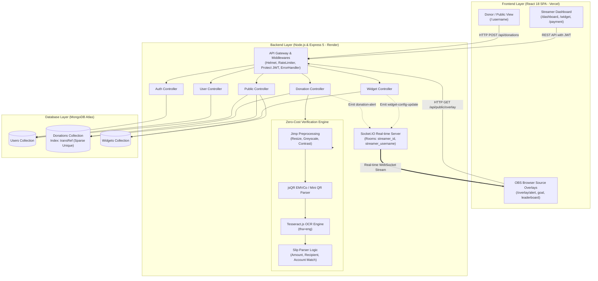
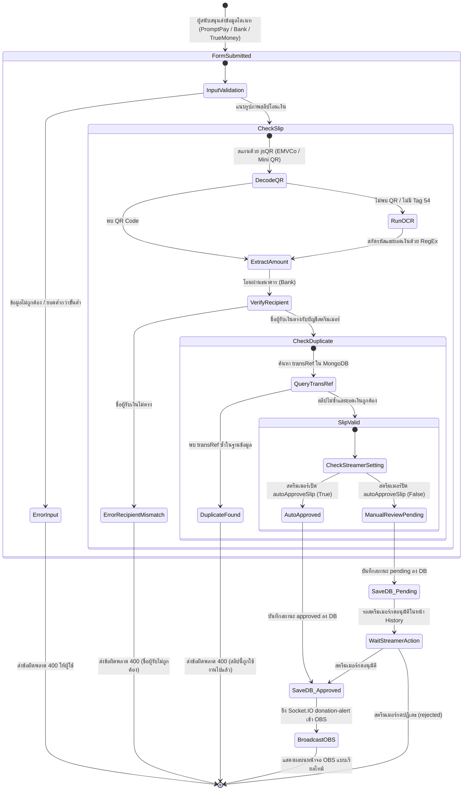

# DONIX - Streamer Donation Platform (AGENTS.md)

เอกสารรวบรวมรายละเอียดสถาปัตยกรรม โครงสร้างโค้ด หน้าระบบทั้งหมด ข้อตกลงในการพัฒนา แนวทางความปลอดภัย
และกระบวนการ CI/CD ของโปรเจกต์ **DONIX** ทั้งในส่วนของ **Client (Frontend)** และ **Server (Backend)**

---

## 1. ข้อมูลภาพรวมของระบบ (Project Overview)

**DONIX** คือแพลตฟอร์มรับบริจาคและสนับสนุนสตรีมเมอร์ (Streamer Donation & Overlay Platform) ในรูปแบบ Monorepo ประกอบด้วย 2 แพ็กเกจหลักที่ทำงานร่วมกัน:

```
Donix/
├── .github/
│   └── workflows/
│       └── ci.yml             → GitHub Actions CI (Automated Test & Build & SonarCloud)
├── client/                    → Frontend React SPA (React 18.3.1 + Tailwind CSS + Lucide React + Recharts)
├── server/                    → Backend REST API & Realtime Server (Express 5 + Socket.IO + MongoDB)
├── sonar-project.properties   → การตั้งค่า SonarCloud Quality Gate & Coverage Exclusions
└── AGENTS.md                  → คู่มือและข้อตกลงในการพัฒนาฉบับสมบูรณ์
```

---

## 2. การติดตั้งและการรันระบบ (Running the Project)

### 2.1 ฝั่ง Server (Backend)

```bash
cd server
npm install
npm run dev           # รันในโหมด Development (Nodemon, Hot-reload บนพอร์ต 5000)
npm start             # รันในโหมด Production
npm test              # รัน Jest + Supertest (10 Suites, 184 Tests ผ่าน 100%)
npm run test:coverage # รัน Jest พร้อมเก็บรายงาน Code Coverage (> 97.59%)
```

### 2.2 ฝั่ง Client (Frontend)

```bash
cd client
npm install
npm start                        # รัน React Dev Server บนพอร์ต 3000 (http://localhost:3000)
npm test -- --watchAll=false     # รัน Jest Test Suite ครั้งเดียวแล้วจบ (26 Suites, 277 Tests ผ่าน 100%)
npm run build                    # Build สำหรับ Production (รองรับ CI=true บน GitHub Actions)
```

### 2.3 คำสั่งทดสอบและตรวจสอบ CI สำหรับ Local Environment

```bash
# ทดสอบฝั่ง Server (Integration Tests + Coverage)
cd server
npm run test:coverage

# ทดสอบฝั่ง Client (Unit Tests + Production Build)
cd client
# สำหรับ CMD (Command Prompt)
set CI=true&& npm test -- --coverage --watchAll=false
set CI=true&& npm run build

# สำหรับ PowerShell (Windows)
$env:CI="true"; npm test -- --coverage --watchAll=false
$env:CI="true"; npm run build
```

---

## 3. สภาพแวดล้อมและการตั้งค่า (Environment Variables)

### 3.1 Server (`server/.env` และ Render)

- **Production URL**: `https://final-project-xntd.onrender.com`
- **API Base URL**: `https://final-project-xntd.onrender.com/api`

| ตัวแปร         | รายละเอียด                                         | ค่าเริ่มต้น (Default / Local)      | ค่าบน Production (Render) |
| :------------- | :------------------------------------------------- | :--------------------------------- | :------------------------ |
| `PORT`         | พอร์ตสำหรับเซิร์ฟเวอร์ Express API                 | `5000`                             | Render กำหนดให้อัตโนมัติ  |
| `MONGODB_URI`  | Connection String สำหรับเชื่อมต่อฐานข้อมูล MongoDB | `mongodb://localhost:27017/donix`  | MongoDB Atlas Cluster     |
| `CLIENT_URL`   | URL ฝั่ง Client สำหรับกำหนดสิทธิ์ CORS             | `http://localhost:3000`            | `https://final-project-orpin-five.vercel.app` |
| `JWT_SECRET`   | คีย์ลับสำหรับเซ็นและตรวจสอบ JWT Token              | กำหนดใน `.env` ฝั่ง Server         | สุ่มค่าคีย์ลับความปลอดภัยสูง |
| `NODE_VERSION` | เวอร์ชัน Node.js ที่ใช้งาน                         | -                                  | `22`                      |

### 3.2 Client (Local และ Vercel)

- **Production URL**: `https://final-project-orpin-five.vercel.app`
- **Base URL ของ API**: กำหนดผ่าน `REACT_APP_API_URL` (Default ในเครื่อง: `http://localhost:5000/api`)
- **Vercel Environment Variable**: `REACT_APP_API_URL=https://final-project-xntd.onrender.com/api`
- การจัดการสิทธิ์และการสื่อสารข้ามโดเมนใช้ CORS จากฝั่ง Server
- การอ่าน JWT Token บน Client มีการจัดการ base64url-safe string decoding ใน `useJwtUser.js`

---

## 4. โครงสร้างและรายละเอียดระบบฝั่ง Server (`server/`)

### 4.1 สถาปัตยกรรมและเทคโนโลยี

- **ES Modules**: กำหนด `"type": "module"` ใน `package.json` ใช้คำสั่ง `import` / `export` ทั้งหมด
- **Express 5**: เวอร์ชัน `^5.2.1` รองรับ Async/Await และ Promise-returning route handlers
- **Security & Protection**: ติดตั้ง `helmet` ป้องกัน Web Security Headers และ `express-rate-limit` ป้องกัน Brute-force บน Auth endpoints
- **Socket.IO**: เชื่อมต่อแบบเรียลไทม์ (Attached กับ `req.io`) สำหรับส่ง Event แจ้งเตือน: `join-stream`, `disconnect`, `donation-alert`
- **Mongoose & MongoDB**: จัดการ Database Schema และเชื่อมต่อ MongoDB
- **Testing**: ทดสอบแบบ Integration ด้วย `Jest` + `Supertest` (ESM mode ผ่าน `--experimental-vm-modules`) รันผ่าน CI พร้อม Coverage Report

### 4.2 โครงสร้างไฟล์ Server

```
server/
├── config/
│   └── db.js                    → การเชื่อมต่อฐานข้อมูล MongoDB (connectDB)
├── controllers/
│   ├── authController.js        → Logic การลงทะเบียนและการเข้าสู่ระบบ (register, login)
│   ├── donationController.js    → Logic การจัดการรายการบริจาค (createDonation, getDonations, getDonationStats, updateDonationStatus)
│   ├── publicController.js      → Logic ข้อมูลสาธารณะสำหรับหน้า Donor Page และ Overlay Config พร้อม Aggregation (getPublicStreamer, getPublicOverlayConfig)
│   ├── userController.js        → Logic จัดการข้อมูลผู้ใช้ (getMe, updateMe, updatePayment, updateDonationPage, changePassword)
│   └── widgetController.js      → Logic จัดการการตั้งค่าวิดเจ็ต (getMyWidget, updateMyWidget), คำนวณ Goal สะสมอัตโนมัติ และ Socket.IO broadcast (widget-config-update)
├── middleware/
│   ├── protect.js               → ตรวจสอบ JWT Bearer Token และใส่ req.user
│   ├── errorHandler.js          → Error Handler กลาง จัดการ error รูปแบบ { message, data } และ Mongoose errors
│   └── rateLimiter.js           → จำกัดอัตราการเรียก API (authLimiter, apiLimiter)
├── Models/
│   ├── Blacklist.js             → Blacklist Schema สำหรับรายชื่อผู้ใช้ที่ถูกบล็อก
│   ├── Donation.js              → Central Donation Schema & Sparse Unique transRef Index
│   ├── Mission.js               → Mission Schema สำหรับภารกิจโดเนท
│   ├── User.js                  → Central User Schema
│   └── Widget.js                → Central Widget Schema (alert, goal, leaderboard, mission, token)
├── routes/
│   ├── auth.js                  → เส้นทาง /api/auth (register, login) พร้อม authLimiter
│   ├── donations.js             → เส้นทาง /api/donations (POST /, GET /, GET /stats, PATCH /:id)
│   ├── public.js                → เส้นทาง /api/public (GET /:username, GET /overlay/:widgetType/:token)
│   ├── users.js                 → เส้นทาง /api/users (GET /me, PUT /me, PUT /payment, PUT /donation-page, PUT /change-password)
│   └── widgets.js               → เส้นทาง /api/widgets (GET /me, PUT /me)
├── services/
│   └── slipVerificationService.js → In-house Zero-Cost Slip QR & OCR Verification Engine (Jimp + jsQR + Tesseract.js Worker Lifecycle)
├── tests/
│   ├── auth.test.js             → ชุดทดสอบ Authentication (13 tests)
│   ├── donations.test.js        → ชุดทดสอบ Donations Route & OCR / Bank Matching (34 tests)
│   ├── errorHandler.test.js     → ชุดทดสอบ Central Error Handler (5 tests)
│   ├── protect.test.js          → ชุดทดสอบ JWT Middleware (5 tests)
│   ├── public.test.js           → ชุดทดสอบ Public Route & Overlay Aggregation (5 tests)
│   ├── slipParser.test.js       → ชุดทดสอบ Thai Slip & QR Parser Utility (26 tests)
│   ├── slipVerificationService.test.js → ชุดทดสอบ Zero-Cost QR/OCR Engine (8 tests)
│   ├── users.test.js            → ชุดทดสอบ Users Route (60 tests)
│   ├── widgetHelpers.test.js    → ชุดทดสอบ Goal Calculation Helpers (3 tests)
│   └── widgets.test.js          → ชุดทดสอบ Widgets Route (15 tests)
│   ── รวมฝั่ง Server: 10 Test Suites, 184 Tests ผ่าน 100% (Coverage > 97.59%)
├── utils/
│   ├── passwordValidation.js    → ฟังก์ชันตรวจสอบความปลอดภัยของรหัสผ่าน (ซิงค์กับ client)
│   ├── slipParser.js            → Helper ถอดรหัส EMVCo TLV, Mini QR ITMX, สกัดจำนวนเงิน, ตรวจชื่อผู้รับเงิน และเลขบัญชี
│   └── widgetHelpers.js         → Helper คำนวณยอดเงินสะสมของ Donate Goal อัตโนมัติจากประวัติการโดเนทจริง
├── app.js                       → Express Application Config (Middlewares, Routes, Error Handler, 10MB payload limit)
├── index.js                     → Entry Point เซิร์ฟเวอร์ Express + Socket.IO (Port 5000, Multi-room Alert Deduplication)
├── jest.config.js               → การตั้งค่า Jest สำหรับ Node.js ESM และ Coverage
└── package.json                 → ESM Scripts พร้อม --runInBand และ --forceExit
```

### 4.3 รายละเอียด User Schema (`server/Models/User.js`)

- **ข้อมูลการยืนยันตัวตน**: `username`, `email`, `password`, `googleId`
- **ข้อมูลโปรไฟล์**: `nickname`, `fullName`, `firstName`, `lastName`, `avatar`, `bio`, `gender`, `birthDate`, `phone`, `isPhoneVerified`, `isEmailVerified`, `isLive` (สถานะเปิดรับเงิน)
- **โซเชียลมีเดีย (`social`)**: `facebook`, `instagram`, `youtube`, `tiktok`, `twitch`, `x`
- **ช่องทางรับเงิน (`payment`)**:
  - `promptpay`: `enabled`, `type` (7 ประเภท: เบอร์โทรศัพท์, เลขบัตรประจำตัวประชาชน, e-Wallet ID, K-Shop, SCB แม่มณี, BBL Merchant Pro, ร้านค้าถุงเงิน), `number`
  - `bank`: `enabled`, `bankName` (7 ธนาคาร), `accountNumber`, `accountName`
  - `truemoney`: `enabled`, `phone`
- **การตั้งค่าหน้ารับเงิน (`donationPage`)**:
  - `welcomeMessage`, `thankYouMessage`, `minAmount`, `charLimit`, `disableFilter`, `filteredWords`, `coverImage`, `backgroundImage`

### 4.4 การป้องกัน NoSQL Injection (บังคับใช้ทุก route)

ทุก route ที่รับค่าจาก `req.body`, `req.query` หรือ `req.params` แล้วนำไปใช้ใน query ของ Mongoose (`findOne`, `find`, `updateOne` ฯลฯ) **ต้องทำตาม 3 ขั้นตอนนี้เสมอ**:

1. **ตรวจชนิดข้อมูลก่อน** ด้วย `typeof` ว่าเป็น `string` (หรือชนิดที่ต้องการ) และปฏิเสธด้วยสถานะ `400` ทันทีหากไม่ตรง
2. **ตัดสาย taint** ด้วยการสร้างตัวแปรใหม่ผ่าน `String(value)` ก่อนนำไปใช้ (ห้ามส่งตัวแปรตรงจาก `req.body`)
3. **ครอบเงื่อนไขด้วย `$eq`** ใน query object เสมอ เช่น `User.findOne({ email: { $eq: safeEmail } })`

ตัวอย่างรูปแบบที่ถูกต้อง (อ้างอิง `server/routes/auth.js`):

```js
const { email } = req.body;

if (typeof email !== "string") {
  return res.status(400).json({ message: "ข้อมูลไม่ถูกต้อง" });
}

const safeEmail = String(email);
const user = await User.findOne({ email: { $eq: safeEmail } });
```

_หมายเหตุ: ไม่ส่งข้อความ Error ภายใน (`err.message`) กลับไปยัง Client ให้บันทึกด้วย `console.error` ฝั่ง Server และส่งข้อความภาษาไทยทั่วไปกลับไปแทน_

### 4.5 รูปแบบมาตรฐานของ API Response (Uniform Response Format)

ทุก endpoint ของเซิร์ฟเวอร์ต้องมีโครงสร้างการตอบกลับที่เป็นมาตรฐานเดียวกัน:

- **กรณีสำเร็จ (Success)**: `{ "message": "...", "data": ... }`
  - หมายเหตุ: สำหรับ Auth endpoints (`register`, `login`) จะแนบ `token` และ `user` ไว้ที่ root ควบคู่กันเพื่อรักษาความเข้ากันได้กับ Client: `{ "message": "...", "token": "...", "user": {...}, "data": { "token": "...", "user": {...} } }`
- **กรณีล้มเหลว (Error)**: `{ "message": "...", "data": null }` พร้อม HTTP Status Code ที่เหมาะสม (400, 401, 404, 500)

---

## 5. โครงสร้างและรายละเอียดระบบฝั่ง Client (`client/`)

### 5.1 สถาปัตยกรรมและเทคโนโลยี

- **React 18.3.1**: Single Page Application (SPA)
- **React Router v7**: กำหนดเส้นทาง URL ทั้งหมดใน `src/App.js` พร้อม `<ProtectedRoute>`
- **Tailwind CSS v3**: ตกแต่ง UI Dark Theme ตามแบรนด์ DONIX:
  - สี: `void` (`#090812`), `abyss` (`#0f0d1b`), `mana` (`#7c3aed`), `gold` (`#fbbf24`), `crimson` (`#ef4444`), `border` (`rgba(255,255,255,0.08)`)
  - ฟอนต์: `Kanit` (Sans-serif ภาษาไทย/สากล) และ `Nanum Myeongjo` (Serif)
- **Lucide React**: ไอคอนมาตรฐานหลักของโปรเจกต์
- **Recharts**: แสดงกราฟสถิติยอดโดเนทในหน้า Dashboard

---

### 5.2 เส้นทาง URL และหน้าระบบทั้งหมด (14 หน้า + 404)

| เส้นทาง (Route)                      | คอมโพเนนต์หน้า | สิทธิ์เข้าถึง      | คำอธิบาย                                                                    |
| :----------------------------------- | :------------- | :----------------- | :-------------------------------------------------------------------------- |
| `/`                                  | `MainPage`     | สาธารณะ            | หน้าแรก (Landing Page), Hero, ฟีเจอร์, รายชื่อสตรีมเมอร์, Footer            |
| `/discover`                          | `Discover`     | สาธารณะ            | หน้าค้นพบสตรีมเมอร์ จัดกลุ่มตามหมวด (กำลังไลฟ์, หมวดเกม, แนะนำ)             |
| `/how-it-works`                      | `HowToUse`     | สาธารณะ            | หน้าคู่มือและขั้นตอนการเริ่มต้นใช้งานระบบสำหรับสตรีมเมอร์และผู้สนับสนุน     |
| `/login`                             | `Login`        | สาธารณะ            | หน้าเข้าสู่ระบบ (Email/Password, Google Auth) รองรับ JWT Token              |
| `/register`                          | `Register`     | สาธารณะ            | หน้าสมัครสมาชิก พร้อม Password Checklist ตรวจสอบเงื่อนไข 5 ข้อ              |
| `/dashboard`                         | `Dashboard`    | สมาชิก (Protected) | หน้าสรุปภาพรวมบัญชี (สถิติยอดเงิน, จำนวนโดเนท, กราฟสถิติ, กิจกรรมล่าสุด)    |
| `/payment`                           | `PaymentPage`  | สมาชิก (Protected) | หน้าตั้งค่าช่องทางรับเงิน (PromptPay, TrueMoney, Bank, Coming Soon)         |
| `/donate-page`                       | `DonatePage`   | สมาชิก (Protected) | หน้าตกแต่งหน้ารับเงิน, ข้อความต้อนรับ/ขอบคุณ, ตัวกรองคำหยาบ, โซเชียล        |
| `/account`                           | `Account`      | สมาชิก (Protected) | หน้าจัดการโปรไฟล์ ข้อมูลส่วนตัว ความปลอดภัย และเชื่อมต่อโซเชียล 6 แพลตฟอร์ม |
| `/history`                           | `HistoryPage`  | สมาชิก (Protected) | หน้าประวัติการรับเงิน ตารางรายการโดเนท พร้อมตัวกรองสถานะ                    |
| `/widget`                            | `WidgetPage`   | สมาชิก (Protected) | หน้าตั้งค่าวิดเจ็ต OBS (Alert, Goal, Leaderboard, Mission) + Live Preview   |
| `/overlay/alert/:token`              | `OverlayAlertPage` | สาธารณะ        | หน้า Browser Source สำหรับ OBS Studio (พื้นหลังใส, FIFO Queue, Realtime Alert) |
| `/overlay/goal/:token`               | `OverlayGoalPage`  | สาธารณะ        | หน้า Browser Source สำหรับ OBS Studio (พื้นหลังใส, แถบความคืบหน้า Goal, Realtime Aggregation) |
| `/overlay/leaderboard/:token`        | `OverlayLeaderboardPage` | สาธารณะ  | หน้า Browser Source สำหรับ OBS Studio (พื้นหลังใส, อันดับผู้สนับสนุน Leaderboard, Realtime Aggregation) |
| `/:username` หรือ `/donor/:username` | `DonorPage`    | สาธารณะ            | หน้ารับเงินจริงสำหรับผู้สนับสนุน (Donor) รองรับ 5 สถานะการทำงาน             |
| `*`                                  | `NotFound`     | สาธารณะ            | หน้าแจ้งเตือน 404 Not Found เมื่อไม่พบเส้นทาง URL                           |

---

### 5.3 รายละเอียดของแต่ละหน้าระบบหลัก

#### 1) หน้าแรก (MainPage) & หน้าสาธารณะ

- **MainPage (`/`)**: Navbar, Hero Section, Features Showcase, Streamer Showcase, CTA Section, Footer
- **Discover (`/discover`)**: จัดหมวดหมู่สตรีมเมอร์ที่กำลังไลฟ์, หมวดเกมยอดนิยม, ค้นหาและแนะนำสตรีมเมอร์
- **HowToUse (`/how-it-works`)**: ขั้นตอนการใช้งาน 4 ขั้นตอน พร้อมจุดเด่นและคำแนะนำสำหรับสตรีมเมอร์มือใหม่

#### 2) หน้าเข้าสู่ระบบและสมัครสมาชิก (Auth)

- **Login (`/login`)**: รองรับการล็อกอินด้วย Email และรหัสผ่าน หรือ Google OAuth พร้อมแจ้งเตือนข้อผิดพลาด
- **Register (`/register`)**: ระบบสมัครสมาชิก พร้อม `PasswordChecklist` ตรวจสอบความปลอดภัยแบบเรียลไทม์ 5 ข้อ (ความยาว, ตัวพิมพ์เล็ก, ตัวพิมพ์ใหญ่, ตัวเลข, อักขระพิเศษ)

#### 3) หน้าแดชบอร์ด (Dashboard) — `/dashboard`

- การ์ดสถิติ (StatCards): ยอดการรับเงินรวม (บาท), จำนวนครั้งที่โดเนท, จำนวนรายการที่รอดำเนินการ (ดึงจาก `GET /api/donations/stats`)
- กราฟสถิติโดเนท (DonationChart): แสดงสถิติโดเนทแบบแท่ง/เส้นด้วย Recharts รองรับรายสัปดาห์และรายเดือนจาก Aggregated Pipeline จริง
- ฟีดกิจกรรมล่าสุด (RealtimeFeed): แสดงรายการโดเนทล่าสุด 5 รายการจากเซิร์ฟเวอร์
- อันดับผู้สนับสนุนสูงสุด (TopDonors): จัดอันดับผู้สนับสนุนยอดสูงสุดจากฐานข้อมูล MongoDB
- ภาพรวมช่องทางรับเงิน (PaymentChannels)
- ใช้เลย์เอาต์ร่วม **Sticky Sidebar** ด้านซ้าย และ **Sticky Topbar** ด้านบน

#### 4) หน้าบัญชีรับเงิน (PaymentPage) — `/payment`

- แผงการ์ด 4 ช่องทางการเงิน (2x2 Grid):
  - **PromptPayCard**: เปิด/ปิดการรับเงิน (บันทึกอัตโนมัติทันทีเมื่อสลับสวิตช์), เมนูจัดการ, สลับเบอร์โทรศัพท์/บัตร ปชช., บันทึกข้อมูล
  - **TrueMoneyCard**: เปิด/ปิดการรับเงิน (บันทึกอัตโนมัติทันทีเมื่อสลับสวิตช์), ฟอร์มเบอร์โทรศัพท์ TrueMoney Wallet
  - **BankCard**: เปิด/ปิดการรับเงิน (บันทึกอัตโนมัติทันทีเมื่อสลับสวิตช์), เลือกธนาคาร (SCB, KBank, BBL, KTB ฯลฯ), เลขบัญชี, ชื่อบัญชี
  - **ComingSoonCard**: ช่องทางใหม่ในอนาคต (เช่น บัตรเครดิต/เดบิต, Crypto)

#### 5) หน้าตกแต่งหน้ารับเงิน (DonatePage) — `/donate-page`

- **DonatePageLink**: ลิงก์ส่วนตัว `donix.app/{username}`, ปุ่มคัดลอกลิงก์, ปุ่มแชร์, ปุ่มเปิดหน้า Donor Page
- **DecorateSection**: แก้ไขข้อความต้อนรับ, ข้อความขอบคุณ, กำหนดยอดโดเนทขั้นต่ำ, อัปโหลดรูปภาพหน้าปกและพื้นหลัง
- **MessageFilterSection**: กำหนดความยาวตัวอักษรสูงสุด, สวิตช์เปิด/ปิดตัวกรองคำหยาบ, ระบบแท็กคำที่ต้องการบล็อก
- **SocialMediaSection**: เชื่อมต่อและแสดงผลลิงก์โซเชียลมีเดีย 6 แพลตฟอร์ม

#### 6) หน้ารับเงินจริงสำหรับผู้สนับสนุน (DonorPage) — `/:username` หรือ `/donor/:username`

- **เปิดให้บริการตลอดเวลา (Always Online)**: ผู้สนับสนุนเข้าถึงหน้าโดเนทได้ตลอด 24 ชม. ไม่ต้องรอสลับสถานะออฟไลน์/ออนไลน์
- สถานะการเปิด/ปิดช่องทางรับเงินขึ้นอยู่กับการตั้งค่าสวิตช์ในหน้า **Payment (`/payment`)** โดยตรง:
  1. **PromptPay**: แสดง PromptPay QR Code อัตโนมัติตามยอดเงิน, ลากวางอัปโหลดสลิป, ปุ่มยืนยัน
  2. **Bank**: แสดงข้อมูลบัญชีธนาคารพร้อมปุ่มคัดลอกเลขบัญชี แสดงยอดโดเนทขั้นต่ำชัดเจนทั้งภายในการ์ดและป้ายเตือน ไม่ต้องกรอกจำนวนเงินเอง ระบบจะอ่านยอดเงินและตรวจสอบชื่อผู้รับเงินจากสลิปผ่าน OCR/Mini QR อัตโนมัติ
  3. **TrueMoney**: แสดงช่องทางทรูมันนี่สำหรับโอนเงิน/อั่งเปา
  4. **Channel Disabled**: แสดงการ์ด "ไม่พร้อมให้บริการ" เมื่อสตรีมเมอร์ปิดสวิตช์ช่องทางนั้นๆ ในหน้า Payment

#### 7) หน้าตั้งค่าวิดเจ็ต OBS (WidgetPage) — `/widget`

- รองรับการตั้งค่าวิดเจ็ต 4 รูปแบบใน Layout 2 คอลัมน์ (ฟอร์มตั้งค่า + Real-time Preview เสมือนจริง):
  1. **Donate Alert**:
     - _พื้นฐาน_: ยอดขั้นต่ำที่แจ้งเตือน (บาท), อัปโหลดรูปภาพแสดงผล (JPG/PNG/GIF)
     - _เสียง & TTS_: เสียงแจ้งเตือน Presets (Mythic Horn, Dragon Roar, Ancient Bell, เสียง MP3 ของฉัน, ปิดเสียง), ตัวปรับระดับเสียง, TTS อ่านข้อความโดเนท (ไทย/อังกฤษ, ชาย/หญิง, ความเร็ว 0.5x–2.0x)
     - _ข้อความ_: Message Template `{user} {amount}`, Shine Effect, ฟอนต์ (Kanit, FC Vision), ขนาดตัวอักษร, Palette สี (ข้อความ, ชื่อ, จำนวนเงิน, สีขอบตัวอักษร), ขนาดขอบตัวอักษร
     - _เอฟเฟกต์ & Tiers_: แอนิเมชั่นเข้า/ออก, เวลาแสดงผล, ฟิลเตอร์ (Glow, Pulse, Shake, Glitch ฯลฯ), ระบบแสดงผลตามช่วงยอดเงิน (Amount Tiers) ปรับเสียงและเอฟเฟกต์แยกตามยอดเงิน
     - _การทดสอบ Alert_: ปุ่ม "ทดสอบ Alert" อยู่เฉพาะในแท็บนี้ สามารถทดสอบแจ้งเตือนสดไปยัง OBS Studio และ Preview ได้ทันที
  2. **Donate Goal**:
     - ชื่อเป้าหมาย, ธีมสี (Mana, Crimson, Gold), ยอดเริ่มต้น/ยอดเป้าหมาย, กำหนดช่วงวันที่, หลอดความคืบหน้า Progress Bar เรืองแสง
     - **คำนวณยอดสะสมอัตโนมัติ (Auto-calculated Current Amount)**: ระบบคำนวณยอดสะสม (`currentAmount`) จากประวัติการบริจาคที่สำเร็จจริง (`completed`) ในช่วงวันเวลาของเป้าหมายอัตโนมัติ และแสดงผลเป็น Read-only ป้องกันข้อมูลคลาดเคลื่อน
  3. **Leaderboard**:
     - ชื่อหัวข้อ, สวิตช์แสดงยอดเงิน, กำหนดช่วงเวลา, ปรับจำนวนอันดับ 1–10 (Stepper +/-)
     - **ปรับปรุง Typography & ขยาย Layout**: ออกแบบฟอนต์และกรอบแสดงผลให้อ่านง่าย คมชัดสูงสุดเมื่อแสดงผลใน OBS Studio
     - **ป้องกันข้อมูลทดสอบปนเปื้อน**: กรองการแจ้งเตือนทดสอบ (`isTest: true`) ไม่ให้นำมาบวกใน Leaderboard และ Goal จริง
  4. **Mission Donate**: จัดการช่องภารกิจสูงสุด 12 ช่อง (ชื่อภารกิจ + ราคา ฿) สำหรับนำไปแสดงผลบน Donor Page
- **BrowserSourceCard**:
  - แสดงป้ายสถานะ `Live` / `ยังไม่ได้บันทึก`, Browser Source URL สำหรับ OBS, และปุ่มคัดลอก URL
  - **แนะนำขนาดที่เหมาะสมใน OBS**: แสดงขนาดความกว้าง x สูงที่แนะนำใน OBS Properties (Alert: `800x600`, Goal: `600x120`, Leaderboard: `450x650`) เพื่อให้ภาพและตัวอักษรคมชัดสูงสุด ไม่แตกจากการลากยืดกรอบสีแดง
  - **ปุ่มทดสอบเฉพาะแท็บ**: ปุ่ม "ทดสอบ Alert" จะแสดงเฉพาะในแท็บ Donate Alert เท่านั้น สำหรับแท็บ Goal และ Leaderboard ปุ่ม "คัดลอก URL" จะขยายเต็มพื้นที่
- **ระบบซิงค์การตั้งค่าแบบเรียลไทม์ (Live OBS Config Sync)**:
  - สตรีมเมอร์ปรับแต่งค่าในหน้า `WidgetPage` ระบบจะ Debounce และส่งสัญญาณ Socket.IO `widget-config-update` ไปอัปเดตหน้า OBS Browser Source อัตโนมัติทันทีโดยไม่ต้อง Refresh หรือลบใส่ Browser Source ใหม่ใน OBS Studio
  - ระบบ **Persistent Reconnect & Multi-room Rejoining**: บันทึก Stream Room (`streamer_${token}` หรือชื่อสตรีมเมอร์) ไว้ใน Socket client เมื่อการเชื่อมต่อขาดหายหรือ Reconnect จะเข้าห้องเดิมทั้งหมดอัตโนมัติ ทำให้ OBS ทำงานต่อเนื่องไม่หลุด
- **Overlays สำหรับ OBS Studio (Clean Stream Display)**:
  - **OverlayAlertPage (`/overlay/alert/:token`)**: พื้นหลังโปร่งใส 100%, FIFO Alert Queue พร้อมคูลดาวน์ 400ms, กรอง `minAmount`, Tiers, Web Audio API Presets, และ Responsive Thai TTS
  - **OverlayGoalPage (`/overlay/goal/:token`)**: พื้นหลังโปร่งใส 100%, แถบ Progress Bar เรืองแสง, ซิงค์ยอดเงินสะสมจริงและอัปเดตแบบเรียลไทม์
  - **OverlayLeaderboardPage (`/overlay/leaderboard/:token`)**: พื้นหลังโปร่งใส 100%, แสดงอันดับผู้สนับสนุน 1-20 พร้อมมงกุฎและเหรียญรางวัล, ตัวอักษรคมชัด ไม่แตก
  - **ไม่มีปุ่มทดสอบลอยบน Browser Source**: หน้า Overlay ทั้งหมดไม่มีปุ่มหรือแถบควบคุมใดๆ ลอยมารบกวนจอถ่ายทอดสด มอบประสบการณ์ระดับมืออาชีพ 100%

#### 8) หน้าจัดการบัญชี (Account) — `/account`

- `AccountProfileCard`: แสดงรูปโปรไฟล์ Avatar, ชื่อผู้ใช้, อีเมล, สถานะการยืนยันตัวตน พร้อมระบบอัปโหลดเปลี่ยนรูป Avatar (แปลงเป็น Base64) และแก้ไขชื่อเล่น (Nickname) บันทึกผ่าน `PUT /api/users/me`
- `AccountTabs`: แท็บสลับ 3 หมวดหมู่:
  - **UserInfoTab**: จัดการข้อมูลส่วนตัว, ชื่อแสดงผล, ข้อมูลติดต่อ
  - **SecurityTab**: จัดการรหัสผ่าน, เปลี่ยนรหัสผ่านใหม่พร้อม Checklist
  - **SocialMediaTab**: เชื่อมต่อลิงก์โซเชียลมีเดียทั้ง 6 แพลตฟอร์ม

#### 9) หน้าประวัติการรับเงิน (HistoryPage) — `/history`

- แสดงสถิติสรุปยอดโดเนททั้งหมด, จำนวนรายการที่สำเร็จ (ดึงจาก `GET /api/donations`)
- ตารางประวัติการรับเงิน `DonationHistoryTable` แสดงวันเวลา, ผู้สนับสนุน, จำนวนเงิน, ช่องทางที่ใช้, ข้อความ, รูปสลิปโอนเงิน, และสถานะ (`completed`, `pending`, `rejected`)
- รองรับตัวกรองสถานะ (`ทั้งหมด`, `สำเร็จ`, `รอดำเนินการ`, `ปฏิเสธ`), ช่องค้นหาชื่อผู้สนับสนุนหรือ Transaction ID, และระบบแบ่งหน้า (Pagination)
- `SlipModal`: ป๊อปอัปตรวจสอบสลิปโอนเงินขยายใหญ่ พร้อมปุ่มอนุมัติ (`อนุมัติ`) หรือปฏิเสธ (`ปฏิเสธ`) รายการโดเนท บันทึกสถานะไปยัง `PATCH /api/donations/:id` แบบเรียลไทม์

---

### 6. โครงสร้างโฟลเดอร์ Component ฝั่ง Client

```
client/src/
├── __mocks__/
│   └── socket.io-client.js    → Mock Socket.IO Client สำหรับ Jest
├── assets/                    → โลโก้และรูปภาพประกอบ (PrimaryLogo, HeroLogo, hero, bg-login)
├── components/
│   ├── Account/               → AccountProfileCard, AccountTabs, ManageAccountCard, SecurityTab, SocialMediaTab, UserInfoTab
│   ├── Auth/                  → AuthLayout, InputField, PasswordChecklist, SocialAuthButtons
│   ├── Dashboard/             → CardWrapper, DonationChart, PaymentChannels, ProtectedRoute, RealtimeFeed, StatsCard, TopDonors
│   ├── Discover/              → CategorySection, StreamerCard
│   ├── DonatePage/            → DecorateSection, DonatePageLink, ImageUploadBox, MessageFilterSection, RichTextField, SettingsCard, SocialMediaSection, DonatePageComponents.test.js
│   ├── Donor/                 → DonorBankForm, DonorDisabledCard, DonorHeader, DonorOfflineCard, DonorPaymentTabs, DonorPromptPayForm, DonorSlipUpload, DonorStatusCard, DonorTrueMoneyForm, DonorComponents.test.js
│   ├── Histor/                → DonationHistoryTable, SlipModal (ชื่อโฟลเดอร์ Histor/ ตามโค้ดดั้งเดิม)
│   ├── HowToUse/              → BenefitsSection, StepsSection
│   ├── MainPage/              → CTASection, Features, Footer, Hero, Navbar, StreamerList
│   ├── Payment/               → BankCard, ComingSoonCard, PaymentHeader, PromptPayCard, TrueMoneyCard
│   ├── Widget/                → AccordionSection, AudioUploadField, BrowserSourceCard, DonateAlertPanel, DonateGoalPanel, LeaderboardPanel, MissionDonatePanel, WidgetHeader, WidgetPreview, WidgetTypeTabs, widgetStorage.js, WidgetComponents.test.js
│   ├── Navigation.test.js     → การทดสอบ Sidebar และ Topbar ร่วมกัน
│   ├── Sidebar.jsx            → เมนูหลักด้านซ้ายแบบ Sticky
│   └── Topbar.jsx             → เมนูด้านบนแบบ Sticky พร้อม Breadcrumb
├── constants/
│   └── socialPlatforms.js     → รายชื่อและไอคอนของแพลตฟอร์มโซเชียลมีเดีย
├── hooks/
│   └── useJwtUser.js          → Custom hook ดึงข้อมูล user จาก JWT ใน localStorage
├── pages/                     → หน้าหลักทั้ง 12 หน้า, NotFound, OverlayAlertPage, OverlayGoalPage, OverlayLeaderboardPage พร้อมไฟล์ `.test.js` ครบชุด
├── utils/
│   ├── alertAudio.js          → ระบบเสียงแจ้งเตือน Web Audio API Synth, custom MP3, Google TTS HTTPS Direct, Web Speech API fallback
│   ├── alertAudio.test.js     → ชุดทดสอบระบบเสียงและการสังเคราะห์เสียง TTS (23 tests)
│   ├── api.js                 → ฟังก์ชัน fetch กลาง (fetchCurrentUser, updateCurrentUser, updatePaymentSettings, updateDonationPageSettings, changePassword, fetchDonationHistory, fetchDonationStats, updateDonationStatus) + API Endpoint Constants
│   ├── passwordValidation.js  → ฟังก์ชันตรวจสอบความปลอดภัยของรหัสผ่าน
│   ├── passwordValidation.test.js
│   ├── sanitizeStorage.js     → ฟังก์ชันกรองและจัดเก็บข้อมูล localStorage ให้ปลอดภัย
│   ├── sanitizeStorage.test.js
│   ├── socket.js              → Socket.IO Client singleton (getSocket, joinStreamRoom, leaveStreamRoom, onDonationAlert, emitTestAlert, onWidgetConfigUpdate, disconnectSocket, Auto-reconnect Registry)
│   └── socket.test.js         → ชุดทดสอบ Socket.IO integration และ Reconnect Room Recovery (11 tests)
├── App.js                     → การกำหนดเส้นทาง URL Routing ทั้งหมด
├── App.test.js                → การทดสอบ Routing ภาพรวม
├── setupTests.js              → การตั้งค่า Jest polyfill (TextEncoder/TextDecoder)
├── index.css                  → สไตล์หลัก Tailwind CSS & Fonts
└── index.js                   → React Root Mounting Entry Point
```

---

## 7. กฎและข้อตกลงสำคัญในการพัฒนา (Key Conventions)

1. **ภาษาและข้อความบน UI**: ข้อความทั้งหมดที่ผู้ใช้เห็น (Labels, Placeholders, Error Messages, Tooltips, Buttons) ให้ใช้ **ภาษาไทย** เสมอ
2. **การใช้งานไอคอน**: ใช้ named imports จาก `lucide-react` เท่านั้น สำหรับโลโก้แบรนด์/โซเชียลมีเดียให้ใช้ SVG inline
3. **เลย์เอาต์ Sidebar และ Topbar**:
   - แดชบอร์ดและหน้าการจัดการต้องมี **Sidebar** (`sticky top-0 h-screen z-30`) และ **Topbar** (`sticky top-0 z-40 backdrop-blur-xl`)
   - **ห้ามใส่ `overflow-x: hidden`** บน Container ชั้นนอกที่ครอบ Sidebar/Topbar เพราะจะทำให้คุณสมบัติ `position: sticky` ของเบราว์เซอร์ไม่ทำงาน
4. **ความปลอดภัยของรหัสผ่าน**: ฟังก์ชัน `utils/passwordValidation.js` มีการใช้งานเหมือนกันทั้งใน `client/` และ `server/` หากมีการปรับเงื่อนไข ต้องอัปเดตทั้ง 2 ฝั่งให้ตรงกันเสมอ
5. **การจัดการ State และ Storage**:
   - หน้า **Account**, **Payment**, **DonatePage**, **DonorPage**, **Dashboard**, **HistoryPage**, และ **Widget** ย้ายขึ้น MongoDB ผ่าน REST API (`api.js`) แล้วทั้งหมด — สำหรับหน้า Widget มีระบบ fallback ไปยัง `widgetStorage.js` และ `sanitizeStorage.js` กรณีออฟไลน์
   - ห้ามเรียก `localStorage` ตรงๆ ในทุกกรณี ให้ใช้ผ่าน `safeGetItem`/`safeSetItem` ใน `sanitizeStorage.js` เสมอ
6. **Zero Warning Policy บน CI**: ตัวแปร `CI=true` บน GitHub Actions จะเปลี่ยน warning ทุกตัวเป็น fatal error ดังนั้นห้ามทิ้ง unused variables หรือ unused imports
7. **การป้องกัน NoSQL Injection**: ทุก route ฝั่ง server ที่รับค่าจาก client ต้องทำตามกฎ 3 ขั้นตอนในหัวข้อ 4.4 อย่างเคร่งครัด
8. **ห้ามทำ Code Duplication ซ้ำซ้อน**: ห้ามคัดลอกบล็อกโค้ดที่ซ้ำกันเกิน 10 บรรทัดข้ามไฟล์ ให้แยกเป็น shared component หรือ hook กลาง เพื่อไม่ให้ติด Quality Gate ของ SonarCloud

---

## 8. สถานะของระบบ (Current Project Status)

| ส่วนงาน                      | สถานะ            | รายละเอียด                                                                                                 |
| :--------------------------- | :--------------- | :--------------------------------------------------------------------------------------------------------- |
| **Backend Foundation**       | ✅ สมบูรณ์       | สถาปัตยกรรมแยก `app.js`/`index.js`, Helmet, Rate Limiter, Error Handler กลาง, Response `{ message, data }` |
| **Auth System**              | ✅ สมบูรณ์       | Register, Login, JWT Token, Password Checklist, ป้องกัน NoSQL Injection, Auth Rate Limiting                |
| **Frontend Pages (12 หน้า)** | ✅ สมบูรณ์       | ทุกหน้าเชื่อมต่อใน `App.js` พร้อม Navigation Bar และ Responsive UI                                         |
| **Widget System**            | ✅ สมบูรณ์       | 4 รูปแบบ (Alert, Goal, Leaderboard, Mission) + Live Preview + OBS Browser URL                              |
| **Phase 4 — REST API Migration** | ✅ สมบูรณ์  | Account (`GET/PUT /api/users/me`), Payment (`PUT /api/users/payment`), DonatePage (`PUT /api/users/donation-page`) ย้ายขึ้น MongoDB แล้วทั้งหมด |
| **Phase 5 — Cloud Deployment**   | ✅ สมบูรณ์  | Server บน Render (`final-project-xntd.onrender.com`), Client บน Vercel (`final-project-orpin-five.vercel.app`), Database บน MongoDB Atlas |
| **Phase 6 — Donation Pipeline & Backoffice** | ✅ สมบูรณ์ | Public API, Donation Submission, Slip Upload, Dashboard Analytics (`/stats`), History Table (`/`), Status Update (`PATCH /:id`) |
| **Phase 7 — Real-time Alert & OBS Widget System** | ✅ สมบูรณ์ (PR #57–#66) | OBS Browser Sources ครบ 3 วิดเจ็ต (Alert, Goal, Leaderboard), FIFO Alert Queue, Web Audio API Presets, Google TTS Direct, Socket.IO Real-time (`donation-alert`, `widget-config-update`), คำนวณยอด Goal สะสมอัตโนมัติ, Persistent Reconnect, Typography & Clean Stream Display, Widget REST API & Models (`Widget`, `Mission`, `Blacklist`) |
| **Test Suites**              | ✅ สมบูรณ์       | Client: 26 Suites (277 Tests ผ่าน 100%), Server: 10 Suites (184 Tests ผ่าน 100%, Coverage > 97.59%), รวม **36 Suites, 461 Tests ผ่าน 100%** |
| **CI / CD Pipeline**         | ✅ สมบูรณ์       | GitHub Actions (`client`, `server`, `sonar`) ผ่านทุก Check พร้อมส่ง Coverage ทั้งสองฝั่ง รองรับ `--forceExit` ป้องกัน Process ค้าง |
| **SonarCloud Quality Gate**  | ✅ ผ่าน          | Security: A, Reliability: A, Duplication ≤ 3%, Coverage on New Code ≥ 80.0%, 0 Bugs, 0 Vulnerabilities    |
| **Database Models**          | ✅ สมบูรณ์       | มีครบ 5 Models: `User`, `Donation`, `Widget`, `Mission`, `Blacklist` บน MongoDB Atlas                     |
| **OCR Slip Verification & Bank Matching** | ✅ สมบูรณ์ | Phase 8 & Extension — In-House QR & OCR Verification Engine (Zero-Cost ด้วย jsQR + Jimp + Tesseract.js), ตรวจจับสลิป PromptPay / Bank Mini QR (ITMX), อ่านจำนวนเงินจากสลิปอัตโนมัติ (Zero-Touch), ตรวจสอบชื่อผู้รับเงินตรงกับบัญชีสตรีมเมอร์ (`isRecipientNameMatched`) พร้อมตัดคำนำหน้าชื่อไทย, ตรวจสอบเลขบัญชี 4 หลักสุดท้าย, ป้องกันสลิปซ้ำด้วย Sparse Unique Index บน `transRef`, และระบบ Auto-Approve แจ้งเตือน OBS ทันที |

---

## 9. กระบวนการ CI (GitHub Actions) และ SonarCloud

ไฟล์ CI: `.github/workflows/ci.yml` รันอัตโนมัติเมื่อ push เข้า `main` หรือเปิด Pull Request เข้า `main`:

| Job      | สภาพแวดล้อม                          | ขั้นตอนการทำงาน                                                                                                       |
| :------- | :----------------------------------- | :-------------------------------------------------------------------------------------------------------------------- |
| `client` | Ubuntu, Node 22, npm 11              | `npm ci` → `npm test -- --coverage --watchAll=false` → `npm run build` → Upload coverage artifact (`client-coverage`) |
| `server` | Ubuntu, Node 22, npm 11              | `npm ci` → `npm run test:coverage` → Upload coverage artifact (`server-coverage`)                                     |
| `sonar`  | Ubuntu (หลัง client และ server ผ่าน) | Download `client-coverage` และ `server-coverage` → SonarQube Scan Action                                              |

### Branch Protection บน `main`

- ล็อกห้าม Push ตรงเข้า `main` ทุกกรณี ต้องเปิด Pull Request เท่านั้น
- ทุก Checks (`CI / client`, `CI / server`, `CI / sonar`, `SonarCloud Code Analysis`) ต้องผ่าน (เครื่องหมายถูกสีเขียว) ก่อน Merge

### ข้อกำหนด SonarCloud Quality Gate

- **Coverage on New Code**: ต้องไม่ต่ำกว่า **80%** (ปัจจุบันทำได้ > 88%)
- **Duplication on New Code**: ต้องไม่เกิน **3%**
- **Security Hotspots & Bugs**: ต้องเป็น **0**

---

## 10. Git Workflow และข้อตกลงในการทำงานร่วมกัน

1. **ห้าม push โค้ดตรงเข้า branch `main`**: ให้แตก branch ย่อยเสมอ เช่น `widget`, `payment`, `history`
2. **การตั้งชื่อ Branch**: ใช้ภาษาอังกฤษตัวพิมพ์เล็กและคั่นด้วยขีดกลาง เช่น `feature-name` (Windows มองชื่อตัวพิมพ์ใหญ่เล็กไม่ต่างกัน ป้องกันปัญหาชื่อซ้ำ)
3. **ก่อนเปิด Pull Request**:
   - รัน `npm test -- --watchAll=false` ใน `client/` เพื่อยืนยันว่าการทดสอบผ่านครบ 100%
   - รัน `set CI=true&& npm run build` เพื่อให้แน่ใจว่าไม่มี Warning ตกค้าง
   - ตรวจสอบ `git status` ไม่ให้ไฟล์ขยะหรือ `.env` หลุดขึ้น Git
4. **การลบ Branch**: เมื่อ Merge เข้า `main` เรียบร้อยแล้ว สามารถลบ Local Branch ได้ด้วย `git branch -d <branch_name>`
5. **การจัดการ Conflict**: ตรวจสอบและแก้ไขให้เรียบร้อย ห้ามทิ้งเครื่องหมาย `<<<<<<<`, `=======`, `>>>>>>>` ไว้ในโค้ดหรือเอกสารอย่างเด็ดขาด

---

## 11. แผนงานระยะถัดไป (Upcoming Phases)

> **Phase 1–7 เสร็จสมบูรณ์แล้ว** ✅ — Backend Foundation, Auth, Frontend Pages, Widget System, REST API Migration (Account/Payment/DonatePage), Cloud Deployment (Render + Vercel + MongoDB Atlas), Donation Pipeline, Dashboard Analytics & History Backoffice, และ Real-time Alert & OBS Widget System ครบวงจร (PR #57–#66)

- **Phase 5: Deploy (เสร็จสมบูรณ์ ✅)**
  - Server ขึ้น **Render** (`https://final-project-xntd.onrender.com`) พร้อม Reverse Proxy (`trust proxy`), Dynamic Port และ CORS
  - Client ขึ้น **Vercel** (`https://final-project-orpin-five.vercel.app`) ด้วย Create React App preset, Root Directory `client`, และต่อยอด API ผ่าน `REACT_APP_API_URL`
  - Database เชื่อมต่อ **MongoDB Atlas**
  - ผลการทดสอบ: เชื่อมต่อ REST API (`/api/users/me`) ตอบสนอง 401 Unauthorized ตามข้อกำหนด

- **Phase 6: แกนหลัก Donation REST API, Dashboard Analytics & History Backoffice (เสร็จสมบูรณ์ ✅)**
  - **ส่วนที่ 1: Donation Model, Public API & Donor Pipeline (PR #50)**
    - สร้าง `server/Models/Donation.js` (`streamerId`, `donorName`, `amount`, `message`, `paymentMethod`, `status`, `slipImage`, `missionId`) ทำ Compound Index `{ streamerId: 1, createdAt: -1 }`
    - Public Endpoint: `GET /api/public/:username` (ข้อมูลสำหรับ Donor Page ปิดบังข้อมูลส่วนตัว พร้อม NoSQL guard)
    - `POST /api/donations` (สร้างรายการโดเนท พร้อมอัปโหลดสลิป Base64, ตรวจสอบยอดขั้นต่ำ, กรองคำหยาบ และ Socket Alert)
    - ปรับปรุง `DonorPage.jsx` เชื่อมต่อ REST API เซิร์ฟเวอร์จริงแทน `localStorage`
  - **ส่วนที่ 2: Dashboard Analytics, History Backoffice & Slip Management (PR #51)**
    - `GET /api/donations` (ดึงประวัติการโดเนท พร้อม Pagination, ค้นหาชื่อผู้บริจาค/รหัสธุรกรรม, และตัวกรองสถานะสำหรับ `HistoryPage`)
    - `GET /api/donations/stats` (ดึงสถิติรวม ยอดเงิน กราฟตามช่วงเวลา และ Top Donors ด้วย Mongo Aggregation สำหรับ `Dashboard`)
    - `PATCH /api/donations/:id` (อนุมัติ/ปฏิเสธสลิปโอนเงิน อัปเดตสถานะในระบบ พร้อมบันทึกหมายเหตุ)
    - `PUT /api/users/me` รองรับการอัปโหลด Avatar ใหม่ (Base64) และอัปเดต Nickname ในหน้า `Account`
    - เพิ่มคอมโพเนนต์ `SlipModal` ให้สตรีมเมอร์กดดูสลิปขยายใหญ่และกดอนุมัติ/ปฏิเสธได้ทันที
    - ครอบคลุมชุดทดสอบ Jest ทั้งหมด (Server 107 Tests, Client 185 Tests ผ่าน 100%) และผ่าน SonarCloud Quality Gate

- **Phase 7: Real-time Alert & OBS Widget System (เสร็จสมบูรณ์ ✅ - PR #57, #58, #59)**
  - **ส่วนที่ 1: Real-time Alert, FIFO Queue & OBS Alert Overlay (PR #57, #58)**
    - **Overlay Alert Page (`/overlay/alert/:token`)**: พื้นหลังโปร่งใสสำหรับ OBS Studio, รองรับพารามิเตอร์ `demo=1` สำหรับทดสอบ
    - **FIFO Alert Queue**: ระบบคิวแจ้งเตือนแบบ FIFO พร้อมคูลดาวน์ 400ms ป้องกันแอนิเมชั่นและเสียงซ้อนทับ พร้อมปุ่มข้ามและล้างคิว
    - **Audio & TTS Engine**: รองรับ Web Audio API Synth Presets (Mythic Horn, Dragon Roar, Ancient Bell), Custom MP3 Base64, Google TTS HTTPS Direct แบบ `no-referrer`, และ Web Speech API fallback
    - **Socket.IO Real-time Alert**: เชื่อมต่อห้องสตรีมเมอร์ (`join-stream`), รับอีเวนต์ `donation-alert` และปุ่มยิง `test-alert` จากหน้า `WidgetPage` ไปยัง OBS Studio แบบเรียลไทม์
    - **Security Hardening**: กำจัดความเสี่ยง SSRF, แทนที่ `Math.random()` ด้วย CSPRNG (`crypto.getRandomValues`), ป้องกัน Floating Promises ด้วย `void`, และลด Cognitive Complexity
  - **ส่วนที่ 2: Widget Config REST API, Goal/Leaderboard Overlays & MongoDB Models (PR #59)**
    - **Database Schemas**: สร้าง `Widget`, `Mission`, `Blacklist` Models ใน MongoDB Atlas
    - **REST API Endpoints**:
      - `GET /api/widgets/me` (ดึงการตั้งค่าของผู้ใช้ปัจจุบัน)
      - `PUT /api/widgets/me` (บันทึก/อัปเดตการตั้งค่า และ regenerate token)
      - `GET /api/public/overlay/:widgetType/:token` (ดึงการตั้งค่าสาธารณะ พร้อม Donation Aggregation สำหรับ Goal และ Leaderboard)
    - **Overlay Goal Page (`/overlay/goal/:token`)**: แถบความคืบหน้าเรืองแสงสำหรับ OBS, คำนวณยอดเงินสะสมจาก DB อัตโนมัติ พร้อมอัปเดตยอดเพิ่มแบบเรียลไทม์ผ่าน Socket.IO
    - **Overlay Leaderboard Page (`/overlay/leaderboard/:token`)**: อันดับผู้สนับสนุน 1-20 พร้อมมงกุฎ/เหรียญรางวัล, คำนวณ Top Donors จาก DB อัตโนมัติ พร้อม Re-ranking เรียลไทม์ผ่าน Socket.IO
    - **WidgetPage Integration**: เชื่อมต่อ `fetchWidgetConfig` และ `saveWidgetSettings` บันทึกขึ้น MongoDB พร้อม fallback ไปที่ localStorage
  - **ส่วนที่ 3: Live Config Sync, Auto Goal Calculation, Typography & Clean Stream Display (PR #60–#66)**
    - **Auto Goal Calculation (`widgetHelpers.js`) (PR #60, #61)**: ระบบคำนวณยอดสะสมของ Donate Goal อัตโนมัติจากรายการโดเนทจริงที่สำเร็จ (`status === "completed"`) ในช่วงวันเวลาของเป้าหมาย พร้อมตั้งค่าฟิลด์ยอดเงินปัจจุบันเป็น Read-only ในหน้า UI เพื่อความแม่นยำ 100%
    - **Real-time Live OBS Config Sync (PR #62, #63)**: เมื่อสตรีมเมอร์แก้ไขการตั้งค่าวิดเจ็ตใน `WidgetPage` (เช่น สี, ฟอนต์, เป้าหมาย, เสียง ฯลฯ) ระบบจะ Debounce และส่งสัญญาณ `widget-config-update` ผ่าน Socket.IO อัปเดตไปยัง OBS Browser Source แบบเรียลไทม์ทันทีโดยไม่ต้อง Refresh หรือเพิ่ม Browser Source ใหม่ใน OBS Studio
    - **Persistent Reconnect & Multi-room Recovery (PR #64)**: พัฒนาระบบ Room Registry ใน Socket.IO Client singleton ให้จดจำห้องที่เข้าร่วม (`streamer_${token}` หรือชื่อสตรีมเมอร์) เมื่อเน็ตหลุดหรือ Reconnect Socket.IO จะเข้าห้องเดิมทั้งหมดอัตโนมัติ ทำให้ OBS รับข้อมูลต่อเนื่องไม่หลุด
    - **Leaderboard Typography & Clean Stream Display (PR #65, #66)**: ปรับขนาดตัวอักษรและ Layout ของ Leaderboard ให้อ่านง่าย คมชัด ไม่แตกใน OBS Studio, แนะนำขนาด Properties ที่เหมาะสมสำหรับ OBS ใน BrowserSourceCard, แยกปุ่มทดสอบ Alert ให้อยู่เฉพาะแท็บ Alert เท่านั้น, กรองรายการทดสอบ (`isTest: true`) ไม่ให้นำมาบวกใน Leaderboard และ Goal จริง, และลบปุ่มทดสอบที่ลอยอยู่ด้านล่าง Browser Source ออกทั้งหมดเพื่อหน้าจอถ่ายทอดสดที่สะอาดตา 100%
  - ครอบคลุมชุดทดสอบ Jest ทั้งหมด (Server 8 Suites 130 Tests, Client 26 Suites 270 Tests รวม **34 Suites, 400 Tests ผ่าน 100%**) และ Build สำหรับ Production ผ่านฉลุย (0 Warnings, 0 Errors)

- **Phase 8: In-House OCR & Slip Verification Engine (เสร็จสมบูรณ์ ✅)**
  - **Zero-Cost & Offline-First Slip Engine (`slipParser.js`, `slipVerificationService.js`)**:
    - พัฒนาระบบตรวจสอบสลิปภายในระบบด้วย pure JavaScript (`jsqr` + `jimp` + `tesseract.js`) โดยไม่มีค่าบริการ API ภายนอก (Zero-Cost) รันบน CI/CD ได้ 100%
    - **PromptPay / EMVCo Slip QR Parser**: ถอดรหัสโครงสร้าง TLV (Tag-Length-Value) มาตรฐานสลิปธนาคารไทย ดึงรหัสอ้างอิงธุรกรรม (`transRef`), จำนวนเงิน (`amount` จาก Tag 54), และรหัสธนาคารต้นทาง/ปลายทาง (`bankCode`) พร้อมจับคู่รายชื่อ 12 ธนาคารไทยหลัก
    - **Thai Bank Mini QR Support (National ITMX Standard)**: รองรับสลิป QR ขนาดเล็กของแอปธนาคารไทย (เช่น Krungthai NEXT, SCB Easy) ที่ไม่มี Tag 54 โดยระบบจะสกัดรหัสอ้างอิงและส่งต่อให้ OCR อ่านยอดเงินได้อย่างแม่นยำ
    - **Multi-pass Image Preprocessing**: สแกนภาพสลิปแบบหลายรอบ (Original image, Auto-resizing สำหรับภาพขนาดใหญ่ > 800px, Greyscale & Contrast enhancement) เพื่อเพิ่มโอกาสการถอดรหัสแม้ภาพมืดหรือแสงน้อย
  - **Phase 8.1 Extension: Zero-Touch Bank Donation & Recipient Verification**:
    - **ฟอร์มโอนธนาคารแบบคลีน (Zero-Touch UX)**: ผู้สนับสนุนไม่ต้องกรอกยอดเงินเองใน `DonorBankForm` ระบบจะอ่านยอดเงินจากสลิปอัตโนมัติ
    - **การแสดงยอดขั้นต่ำที่เด่นชัด**: แสดงยอดโดเนทขั้นต่ำ (`minAmount`) ทั้งภายในการ์ดบัญชีธนาคารและแถบเตือนสีม่วงด้านล่าง
    - **OCR Multi-strategy Regex Amount Parser (`parseSlipText`)**: สกัดยอดเงินจากข้อความสลิปทั้งแบบมีป้ายกำกับ (`จำนวนเงิน: 50.00 บาท`), แบบหลายบรรทัด (`จำนวนเงิน \n 50.00`), และแบบยอดเงินพร้อมสกุลเงิน (`50.00 THB / บาท`)
    - **การตรวจสอบชื่อผู้รับเงินตรงกับบัญชีสตรีมเมอร์ (`isRecipientNameMatched`)**:
      - ทำการ Normalize ข้อความและตัดคำนำหน้าชื่อไทย (`นาย`, `นาง`, `นางสาว`, `ด.ช.`, `บจก.`, `หจก.` ฯลฯ)
      - รองรับการย่อนามสกุลของแอปธนาคาร (เช่น `มนต์ธร ก.` เทียบกับ `มนต์ธร กฤตยาพงศ์`)
      - ปฏิเสธรายการทันทีด้วย HTTP 400 หากชื่อผู้รับเงินไม่ตรงกับบัญชีของสตรีมเมอร์ (`streamer.payment.bank.accountName`)
    - **การตรวจสอบเลขบัญชี (`isAccountNumberMatched`)**: ตรวจสอบความถูกต้องของเลขที่บัญชี 4 หลักสุดท้าย
    - **การตรวจสอบยอดเงินขั้นต่ำ**: ตรวจสอบว่ายอดเงินที่อ่านได้จากสลิปไม่ต่ำกว่ายอดขั้นต่ำ (`minAmount`) ที่สตรีมเมอร์กำหนด
  - **Duplicate Slip Prevention (ป้องกันการใช้สลิปซ้ำ 100%)**:
    - กำหนด Sparse Unique Index บนฟิลด์ `transRef` ในโมเดล `Donation`:
      `{ transRef: 1 }, { unique: true, sparse: true, partialFilterExpression: { transRef: { $type: "string" } } }`
    - ตรวจสอบซ้ำใน `createDonation` หากพบว่า `transRef` เคยถูกบันทึกสำเร็จในระบบแล้ว จะปฏิเสธคำขอทันทีด้วย HTTP 400 (`"สลิปนี้ถูกใช้งานไปแล้ว..."`)
    - ตรวจสอบความถูกต้องของยอดเงิน (Amount Mismatch): หากยอดเงินในสลิปน้อยกว่ายอดเงินบริจาคที่แจ้ง ระบบจะปฏิเสธด้วย HTTP 400
  - **Real-time Auto-Approve & OBS Broadcast**:
    - เมื่อสลิปถูกต้องตามเงื่อนไข (ยอดเงินตรงและสลิปไม่ซ้ำ) ระบบจะปรับสถานะเป็น `approved` ทันที และส่ง Event `donation-alert` ผ่าน Socket.IO ตรงไปยัง OBS Studio Overlay
    - สตรีมเมอร์สามารถเปิด/ปิดการอนุมัติอัตโนมัติได้ผ่านสวิตช์ `autoApproveSlip` ในหน้าตั้งค่า `DonatePage` หากปิด ระบบจะเก็บเป็น `pending` พร้อมผลตรวจ OCR เพื่อให้สตรีมเมอร์ตรวจสอบด้วยตนเอง
    - กรณีรูปสลิปไม่สามารถอ่าน QR Code หรือข้อความได้ ระบบจะแจ้งเตือนให้ใช้สลิปที่คมชัด หรือบันทึกเป็น `pending` กรณีมีจำนวนเงิน
  - **CI/CD Lifecycle & Worker Management**:
    - จัดการ Worker Lifecycle ด้วย `terminateOcrWorker()` ใน `afterAll` ของ Test Suites ทั้งหมด
    - เพิ่มแฟล็ก `--forceExit` ในสคริปต์ `test` และ `test:coverage` ใน `server/package.json` ป้องกันปัญหากระบวนการค้างบน GitHub Actions
    - เพิ่ม `*.traineddata` ลงใน `.gitignore` ป้องกันการบันทึกไฟล์ Binary ของภาษาเข้าสู่ Git
  - ครอบคลุมชุดทดสอบ Jest ทั้งหมด (Server 10 Suites 184 Tests Coverage > 97.59%, Client 26 Suites 277 Tests รวม **36 Suites, 461 Tests ผ่าน 100%**) และ Build สำหรับ Production ผ่านฉลุย (0 Warnings, 0 Errors)

---

## 12. ข้อมูลอ้างอิงสำหรับจัดทำเล่มรายงานโครงงานโปรเจกต์จบ (Final Project Report Guide)

หมวดนี้จัดทำขึ้นเป็นพิเศษเพื่อเป็นคลังข้อมูลทางเทคนิคสำหรับนำไปเขียนและอ้างอิงใน **เล่มรายงานโครงงานโปรเจกต์จบ (Senior Project Report)** ครอบคลุมตั้งแต่บทที่ 2 ถึงบทที่ 5

```
โครงสร้างเล่มรายงานโครงงาน:
├── บทที่ 1: บทนำ (Introduction) - [ผู้พัฒนาจัดทำแล้ว]
├── บทที่ 2: ทฤษฎีและเทคโนโลยีที่เกี่ยวข้อง (Literature Review & Underlying Technologies)
├── บทที่ 3: การวิเคราะห์และออกแบบระบบ (System Analysis & System Design)
├── บทที่ 4: การพัฒนาระบบและการทดสอบ (Implementation & Testing)
└── บทที่ 5: สรุปผลการดำเนินงาน ปัญหา อุปสรรค และข้อเสนอแนะ (Conclusion & Future Work)
```

---

### 12.1 สรุปเนื้อหาสำหรับ บทที่ 2: ทฤษฎีและเทคโนโลยีที่เกี่ยวข้อง

สามารถนำหัวข้อและรายละเอียดต่อไปนี้ไปเรียบเรียงใน **บทที่ 2** ของเล่มรายงาน:

#### 1) สถาปัตยกรรมซอฟต์แวร์ Monorepo และการแยกส่วน Client-Server
- **Monorepo Architecture**: การรวมโค้ด Frontend และ Backend ไว้ใน Repository เดียวกัน ช่วยให้การควบคุม Version, การจัดการ Script ทดสอบ, และกระบวนการ CI/CD มีความสอดคล้องกัน
- **Single Page Application (SPA)**: การทำงานของ React ที่โหลดหน้าเว็บครั้งเดียว แล้วใช้ Client-side Routing สลับหน้าจออย่างรวดเร็วโดยไม่ต้อง Refresh เบราว์เซอร์

#### 2) เทคโนโลยีฝั่งผู้ใช้งาน (Frontend Technologies)
- **React 18.3.1**: การจัดการ State, Hooks (`useState`, `useEffect`, `useCallback`, `useRef`), Virtual DOM และการประมวลผล Component แบบเชิงฟังก์ชัน (Functional Components)
- **React Router v7**: การจัดการเส้นทาง URL (Routing) ทั้งแบบ Public Route และ Protected Route ที่ตรวจสิทธิ์ผ่าน JWT Token
- **Tailwind CSS v3**: Utility-First CSS Framework สำหรับตกแต่ง UI ในธีม Dark Mode ตามโทนสีของแบรนด์ DONIX (`#090812`, `#7c3aed`, `#fbbf24`)
- **Lucide React**: Vector Icon Library แบบ Lightweight สำหรับแสดงสัญลักษณ์ในหน้าจอ
- **Recharts**: Data Visualization Library บนฐานของ SVG สำหรับแสดงผลกราฟแท่งและกราฟเส้นสถิติยอดโดเนทใน Dashboard
- **Web Audio API**: การสังเคราะห์เสียงแจ้งเตือนแบบ Procedural Audio Presets (ไม่ต้องพึ่งพาไฟล์เสียงขนาดใหญ่) ควบคู่กับ Text-to-Speech (TTS) สังเคราะห์เสียงพูดภาษาไทย

#### 3) เทคโนโลยีฝั่งเซิร์ฟเวอร์ (Backend Technologies)
- **Node.js 22**: JavaScript Runtime สภาพแวดล้อมฝั่งเซิร์ฟเวอร์แบบ Non-blocking I/O และ Event-driven
- **Express 5**: เว็บเฟรมเวิร์กเวอร์ชันล่าสุดที่รองรับ Native Promise-returning handlers ช่วยให้การจัดการ Async Middleware และ Error Handling มีประสิทธิภาพสูง
- **Socket.IO 4**: ไลบรารีการสื่อสารแบบ Real-time Bidirectional ผ่าน WebSocket Protocol รองรับระบบ Rooms สำหรับแยกห้องสตรีมเมอร์แต่ละคน และระบบ Auto-reconnection

#### 4) ระบบฐานข้อมูล (Database System)
- **MongoDB Atlas**: ฐานข้อมูลแบบ NoSQL Document-oriented Database บนระบบ Cloud รองรับการจัดเก็บข้อมูลที่มีโครงสร้างยืดหยุ่นในรูปแบบ JSON/BSON
- **Mongoose ODM**: Object Data Modeling Library สำหรับ Node.js ช่วยกำหนด Schema, Data Validation, Middleware Hooks, และ Compound/Sparse Unique Indexing
- **MongoDB Aggregation Pipeline**: การคำนวณและประมวลผลข้อมูลสถิติที่ซับซ้อน เช่น การหายอดรวมเงินบริจาค, การจัดอันดับ Top Donors, และการสรุปยอดสะสมตามช่วงวัน/เดือน

#### 5) เทคโนโลยีการประมวลผลรูปภาพและการรู้จำอักขระ (Image Processing & OCR)
- **jsQR**: Pure JavaScript Library สำหรับถอดรหัส QR Code จากพิกเซลภาพ รองรับมาตรฐาน ISO/IEC 18004
- **Jimp**: Pure JavaScript Image Processing Library สำหรับอ่านไฟล์รูปภาพ, การแปลงขนาด (Resize), การปรับระดับสีเทา (Greyscale), และการเพิ่มความเปรียบต่าง (Contrast) ก่อนนำไปสแกน QR/OCR
- **Tesseract.js**: พอร์ตของ Tesseract OCR Engine บน WebAssembly ช่วยให้รันการรู้จำข้อความภาษาไทยและอังกฤษ (`tha+eng`) ได้โดยตรงบน Node.js โดยไม่ต้องติดตั้ง Binary ภายนอกระบบ
- **มาตรฐานสลิปธนาคารไทย (EMVCo & National ITMX Standard)**: รูปแบบ Tag-Length-Value (TLV) เช่น Tag 00 (Format), Tag 30/01 (Bank Code & TransRef), Tag 54 (Amount)

#### 6) ความมั่นคงปลอดภัยของระบบเว็บ (Web Application Security)
- **JSON Web Token (JWT)**: การยืนยันตัวตนแบบ Stateless โดยส่ง Signed Token ผ่าน HTTP Header `Authorization: Bearer <token>`
- **NoSQL Injection Prevention**: การป้องกันการแทรกคำสั่งแปลกปลอมใน Mongoose ผ่านการตรวจสอบชนิดข้อมูล (`typeof`), การตัดสาย Taint ด้วย `String()`, และการครอบเงื่อนไขด้วย `$eq` Operator
- **Helmet**: Middleware กำหนดค่า HTTP Security Headers (Content-Security-Policy, X-Frame-Options, X-Content-Type-Options)
- **Rate Limiting (`express-rate-limit`)**: การจำกัดจำนวนคำขอต่อ IP Address เพื่อป้องกันการโจมตีแบบ Brute-force บน Login/Register

#### 7) การทดสอบซอฟต์แวร์และการบูรณาการอย่างต่อเนื่อง (Software Testing & CI/CD)
- **Jest**: JavaScript Testing Framework สำหรับทำ Unit Test และ Integration Test
- **Supertest**: ไลบรารีสำหรับทดสอบ HTTP Endpoints ของ Express Application โดยไม่ต้องเปิดพอร์ตจริง
- **GitHub Actions**: แพลตฟอร์ม CI/CD แบบ Automated Pipeline ตรวจสอบโค้ด, รันชุดทดสอบทั้ง Client และ Server, และตรวจสอบ Production Build
- **SonarCloud**: เครื่องมือวิเคราะห์คุณภาพโค้ดแบบ Static Code Analysis ตรวจสอบ Security Hotspots, Bugs, Code Smells, Code Duplication, และ Code Coverage

---

### 12.2 สรุปเนื้อหาสำหรับ บทที่ 3: การวิเคราะห์และออกแบบระบบ

สามารถนำแบบจำลองและข้อกำหนดต่อไปนี้ไปใช้ใน **บทที่ 3** ของเล่มรายงาน:

#### 1) ความต้องการของระบบ (System Requirements)

##### ความต้องการเชิงหน้าที่ (Functional Requirements: FR)
- **FR-01 (Authentication)**: ผู้ใช้สามารถลงทะเบียน, เข้าสู่ระบบด้วย Email/Password พร้อมตรวจสอบความปลอดภัยรหัสผ่าน 5 ข้อ หรือเข้าสู่ระบบด้วย Google Account
- **FR-02 (Profile Management)**: สตรีมเมอร์สามารถจัดการข้อมูลส่วนตัว, รูปภาพโปรไฟล์ (Avatar), ข้อมูลติดต่อ และเชื่อมต่อโซเชียลมีเดีย 6 แพลตฟอร์ม
- **FR-03 (Payment Setup)**: สตรีมเมอร์สามารถเปิด/ปิด และตั้งค่าช่องทางรับเงิน 3 รูปแบบ (PromptPay 7 ประเภท, บัญชีธนาคาร 7 แห่ง, TrueMoney)
- **FR-04 (Donation Page Decoration)**: สตรีมเมอร์สามารถตกแต่งหน้าโดเนท, กำหนดยอดบริจาคขั้นต่ำ, ข้อความต้อนรับ/ขอบคุณ, ตัวกรองคำหยาบ, และภาพหน้าปก
- **FR-05 (Public Donor Page)**: ผู้สนับสนุนสามารถเข้าหน้ารับเงินของสตรีมเมอร์ (`/:username`) ได้ตลอด 24 ชั่วโมง โดยไม่ต้องรอสตรีมเมอร์เปิดไลฟ์
- **FR-06 (Zero-Touch Bank Transfer & Slip Upload)**: ผู้สนับสนุนสามารถโอนเงินและแนบสลิป โดยระบบจะอ่านยอดเงินและตรวจสอบชื่อผู้รับเงินอัตโนมัติ
- **FR-07 (In-house Slip Verification Engine)**: ระบบตรวจสอบความถูกต้องของสลิป ป้องกันสลิปซ้ำผ่านรหัสอ้างอิงธุรกรรม (`transRef`), ตรวจสอบยอดเงิน และอนุมัติอัตโนมัติ
- **FR-08 (Real-time OBS Overlays)**: แสดงผลวิดเจ็ต 3 รูปแบบบน OBS Studio (Alert, Goal, Leaderboard) ด้วยพื้นหลังโปร่งใสและอัปเดตข้อมูลแบบเรียลไทม์
- **FR-09 (Live Widget Config Sync)**: เมื่อสตรีมเมอร์แก้ไขการตั้งค่าวิดเจ็ตบนเว็บ ระบบจะส่งสัญญาณอัปเดต OBS Browser Source อัตโนมัติทันที
- **FR-10 (Dashboard & History Analytics)**: สตรีมเมอร์สามารถดูสถิติภาพรวม, กราฟแนวโน้มยอดเงิน, ตรวจสอบประวัติสลิป และอนุมัติ/ปฏิเสธรายการได้

##### ความต้องการที่ไม่ใช่เชิงหน้าที่ (Non-Functional Requirements: NFR)
- **NFR-01 (Security)**: ระบบต้องป้องกัน NoSQL Injection, XSS, CSRF, Brute-force และเข้ารหัสรหัสผ่านด้วย `bcryptjs`
- **NFR-02 (Performance & Latency)**: การส่งการแจ้งเตือน Real-time ผ่าน Socket.IO ไปยัง OBS Studio ต้องมีความล่าช้า (Latency) ต่ำกว่า 500 มิลลิวินาที
- **NFR-03 (Zero-Cost Operation)**: ระบบตรวจสอบสลิปต้องทำงานได้ด้วย Open-source libraries ภายในเครื่อง โดยไม่มีค่าใช้จ่ายต่อครั้งของ API ภายนอก
- **NFR-04 (High Reliability)**: ชุดทดสอบของระบบต้องผ่าน 100% พร้อม Code Coverage รวมสูงกว่า 95% และมีระบบ Auto-reconnect Socket
- **NFR-05 (Clean Stream UX)**: หน้า OBS Browser Source ต้องไม่มีปุ่มหรือสิ่งกีดขวางใดๆ ปรากฏบนจอถ่ายทอดสด

#### 2) แผนภาพสถาปัตยกรรมระบบ (System Architecture)



#### 3) วงจรการทำงานของรายการบริจาค (Donation Lifecycle State Machine)



#### 4) โครงสร้างฐานข้อมูล (Database Schema Specifications)

##### 1. User Schema (`server/Models/User.js`)
| ฟิลด์ (Field) | ชนิดข้อมูล (Type) | ดัชนี (Index) | คำอธิบาย |
| :--- | :--- | :--- | :--- |
| `username` | String | Unique, Required | ชื่อผู้ใช้สำหรับ URL หน้ารับเงิน (เช่น `/Test3`) |
| `email` | String | Unique, Required | อีเมลสำหรับเข้าสู่ระบบ |
| `password` | String | - | แฮชรหัสผ่าน (เข้ารหัสด้วย bcryptjs 10 rounds) |
| `nickname` | String | - | ชื่อเล่นสำหรับแสดงผล |
| `avatar` | String | - | รูปโปรไฟล์ (Base64 data URI หรือ URL) |
| `isLive` | Boolean | - | สถานะของสตรีมเมอร์ (Default: true) |
| `payment.promptpay` | Object | - | `{ enabled: Boolean, type: String, number: String }` |
| `payment.bank` | Object | - | `{ enabled: Boolean, bankName: String, accountNumber: String, accountName: String }` |
| `payment.truemoney`| Object | - | `{ enabled: Boolean, phone: String }` |
| `donationPage` | Object | - | `{ minAmount: Number, autoApproveSlip: Boolean, welcomeMessage: String, filteredWords: Array }` |

##### 2. Donation Schema (`server/Models/Donation.js`)
| ฟิลด์ (Field) | ชนิดข้อมูล (Type) | ดัชนี (Index) | คำอธิบาย |
| :--- | :--- | :--- | :--- |
| `streamerId` | ObjectId (Ref: User) | Compound `{ streamerId: 1, createdAt: -1 }` | ไอดีของสตรีมเมอร์ผู้รับเงิน |
| `donorName` | String | - | ชื่อผู้สนับสนุน (Default: 'Anonymous') |
| `amount` | Number | Required | จำนวนเงินบริจาค (บาท) |
| `message` | String | - | ข้อความถึงสตรีมเมอร์ (ผ่านการกรองคำหยาบแล้ว) |
| `paymentMethod`| String | Enum: `promptpay`, `bank`, `truemoney` | ช่องทางที่ใช้ในการชำระเงิน |
| `status` | String | Enum: `pending`, `approved`, `rejected` | สถานะของรายการบริจาค |
| `slipImage` | String | - | รูปภาพสลิปการโอนเงิน (Base64 data URI) |
| `transRef` | String | **Sparse Unique Index** | รหัสอ้างอิงธุรกรรมจากสลิป (ป้องกันการใช้สลิปซ้ำ) |
| `ocrResult` | Object | - | ผลการตรวจสอบ `{ verified, method, bankName, message }` |
| `createdAt` | Date | Default: `Date.now` | วันเวลาที่สร้างรายการ |

##### 3. Widget Schema (`server/Models/Widget.js`)
| ฟิลด์ (Field) | ชนิดข้อมูล (Type) | ดัชนี (Index) | คำอธิบาย |
| :--- | :--- | :--- | :--- |
| `userId` | ObjectId (Ref: User) | Unique, Required | ไอดีของสตรีมเมอร์เจ้าของการตั้งค่า |
| `token` | String | Unique, Indexed | UUID Token ประจำตัวสำหรับ OBS Browser Source |
| `alert` | Object | - | การตั้งค่าการแจ้งเตือน (เสียง, TTS, ฟอนต์, สี, แอนิเมชั่น, Tiers) |
| `goal` | Object | - | การตั้งค่าเป้าหมาย (ชื่อเป้าหมาย, ยอดเป้าหมาย, ธีมสี, วันที่เริ่ม/สิ้นสุด) |
| `leaderboard` | Object | - | การตั้งค่าบอร์ดผู้นำ (จำนวนอันดับ, การแสดงยอดเงิน, ช่วงเวลา) |
| `mission` | Object | - | การตั้งค่าภารกิจโดเนท |

#### 5) ตารางข้อกำหนดส่วนต่อประสาน (RESTful API Specification)

| เส้นทาง (Endpoint) | เมธอด | สิทธิ์ (Auth) | หน้าที่การทำงาน |
| :--- | :---: | :---: | :--- |
| `/api/auth/register` | POST | สาธารณะ | สมัครสมาชิกใหม่ ตรวจสอบความปลอดภัยรหัสผ่าน 5 ข้อ |
| `/api/auth/login` | POST | สาธารณะ | เข้าสู่ระบบและส่งกลับ JWT Token และข้อมูลโปรไฟล์ |
| `/api/users/me` | GET / PUT | Bearer JWT | ดึงและอัปเดตข้อมูลส่วนตัว / Nickname / รูปภาพ Avatar |
| `/api/users/payment` | PUT | Bearer JWT | บันทึกการตั้งค่าช่องทางรับเงิน (PromptPay, Bank, TrueMoney) |
| `/api/users/donation-page` | PUT | Bearer JWT | บันทึกการตั้งค่าหน้าโดเนท (ยอดขั้นต่ำ, Auto-Approve OCR, ข้อความ) |
| `/api/donations` | POST | สาธารณะ | ส่งรายการบริจาค พร้อมถอดรหัสสลิป ตรวจสอบยอดและชื่อผู้รับเงิน |
| `/api/donations` | GET | Bearer JWT | ดึงประวัติรายการบริจาค พร้อมแบ่งหน้าและตัวกรองสถานะ |
| `/api/donations/stats` | GET | Bearer JWT | ดึงข้อมูลสถิติภาพรวม ยอดรวม กราฟ 7D/30D และ Top Donors |
| `/api/donations/:id` | PATCH | Bearer JWT | อนุมัติ (`approved`) หรือปฏิเสธ (`rejected`) รายการโดเนท |
| `/api/widgets/me` | GET / PUT | Bearer JWT | ดึงและบันทึกการตั้งค่าวิดเจ็ต พร้อมยิง Socket ซิงค์ OBS |
| `/api/public/:username` | GET | สาธารณะ | ดึงข้อมูลสำหรับเรนเดอร์หน้า Donor Page ของสตรีมเมอร์ |
| `/api/public/overlay/:type/:token` | GET | สาธารณะ | ดึงการตั้งค่าและยอดสะสมปัจจุบันสำหรับเรนเดอร์ใน OBS Studio |

---

### 12.3 สรุปเนื้อหาสำหรับ บทที่ 4: การพัฒนาระบบและการทดสอบ

สามารถนำผลการพัฒนาและสถิติการทดสอบไปใช้ใน **บทที่ 4** ของเล่มรายงาน:

#### 1) การพัฒนากลไกตรวจสอบสลิปอัตโนมัติ (Zero-Cost Slip Engine)
1. **การถอดรหัส Mini QR & EMVCo**: 
   - ใช้ `jimp` อ่าน Buffer รูปภาพและส่งให้ `jsqr` ค้นหา QR Code
   - หากภาพมีขนาดใหญ่เกิน 800px ระบบจะทำการย่อส่วนลงเหลือ 600px เพื่อเพิ่มความคมชัด
   - รองรับการปรับ Greyscale และ Contrast (+0.2) เพื่อให้สแกนสลิปที่แสงน้อยได้สำเร็จ
2. **การสกัดยอดเงินด้วย OCR Regex (`parseSlipText`)**:
   - หากสลิปไม่มี Tag 54 ใน QR Code (เช่น Mini QR) ระบบจะเรียก `tesseract.js` อ่านข้อความ
   - ใช้ Multi-pattern Regular Expression ในการสกัดตัวเลขทศนิยมสองตำแหน่ง
3. **การตรวจสอบชื่อผู้รับเงินภาษาไทย (`isRecipientNameMatched`)**:
   - ทำความสะอาดข้อความด้วยการลบคำนำหน้าชื่อ: `นาย`, `นางสาว`, `นาง`, `ด.ช.`, `ด.ญ.`, `บจก.`, `หจก.`
   - ตัดวรรคตอนและเครื่องหมายพิเศษออกเพื่อเปรียบเทียบแบบ Substring
   - รองรับกรณีสลิปธนาคารย่อนามสกุลเหลือเพียงอักษรย่อตัวแรก

#### 2) ผลการทดสอบระบบ (Test Results & Metrics)

##### ตารางสรุปชุดทดสอบ (Test Suites Summary)
| ส่วนงาน (Component) | จำนวน Test Suites | จำนวนการทดสอบ (Tests) | สถานะ | อัตราความสำเร็จ |
| :--- | :---: | :---: | :---: | :---: |
| **Server (Backend API & Services)** | **10 Suites** | **184 Tests** | ✅ ผ่านทั้งหมด | **100%** |
| **Client (Frontend React SPA)** | **26 Suites** | **277 Tests** | ✅ ผ่านทั้งหมด | **100%** |
| **รวมทั้งโปรเจกต์ (Monorepo)** | **36 Suites** | **461 Tests** | ✅ ผ่านทั้งหมด | **100%** |

##### ตารางรายงาน Code Coverage ฝั่ง Server (`npm run test:coverage`)
| หมวดหมู่โค้ด (Directory) | Statements (%) | Branch (%) | Functions (%) | Lines (%) | สถานะ Quality Gate |
| :--- | :---: | :---: | :---: | :---: | :---: |
| `controllers/` | 97.29% | 88.18% | 96.00% | 97.43% | ✅ เกินเกณฑ์มาตรฐาน |
| `middleware/` | 100.00% | 91.66% | 100.00% | 100.00% | ✅ ผ่าน 100% |
| `routes/` | 100.00% | 100.00% | 100.00% | 100.00% | ✅ ผ่าน 100% |
| `utils/` | 97.48% | 80.27% | 100.00% | 97.42% | ✅ เกินเกณฑ์มาตรฐาน |
| **ภาพรวมไฟล์ทั้งหมด (All Files)** | **97.50%** | **86.19%** | **97.95%** | **97.59%** | **✅ ยอดเยี่ยม (> 97%)** |

##### ผลการตรวจสอบคุณภาพและความปลอดภัยด้วย SonarCloud
- **Quality Gate Status**: Passed (ผ่านเกณฑ์ระดับสูงสุด)
- **Security Rating**: A (0 Vulnerabilities, 0 Security Hotspots)
- **Reliability Rating**: A (0 Bugs)
- **Maintainability Rating**: A (0 Code Smells รุนแรง)
- **Duplication on New Code**: ≤ 3.0% (ปฏิบัติตามกฎห้ามโค้ดซ้ำซ้อนอย่างเคร่งครัด)
- **Coverage on New Code**: ≥ 80.0% (ทำได้จริง > 88% - 97%)

---

### 12.4 สรุปเนื้อหาสำหรับ บทที่ 5: สรุปผลการดำเนินงาน ปัญหา อุปสรรค และข้อเสนอแนะ

สามารถนำเนื้อหาด้านล่างไปสรุปใน **บทที่ 5** ของเล่มรายงาน:

#### 1) สรุปผลสำเร็จของโครงงาน (Conclusion)
โครงงานระบบรับบริจาคและสนับสนุนสตรีมเมอร์ (DONIX) บรรลุตามวัตถุประสงค์ที่กำหนดไว้ทุกประการ:
1. พัฒนาเว็บแอปพลิเคชันสำหรับสตรีมเมอร์และผู้สนับสนุนได้ครบ 14 หน้า พร้อมหน้า Browser Source Overlays 3 รูปแบบ
2. พัฒนาระบบตรวจสอบสลิปการโอนเงินอัตโนมัติภายในระบบ (Zero-Cost In-House QR & OCR Engine) สำเร็จโดยไม่มีค่าใช้จ่าย API ต่อรายการ
3. ป้องกันการทุจริตและการใช้สลิปซ้ำได้ 100% ด้วยระบบ Sparse Unique Database Indexing
4. ตรวจสอบชื่อผู้รับเงินในสลิปกับชื่อบัญชีสตรีมเมอร์ได้อย่างถูกต้อง รองรับการตัดคำนำหน้าชื่อไทยและการย่อนามสกุล
5. ซิงค์การแสดงผลบน OBS Studio ได้แบบเรียลไทม์ และมีระบบคำนวณยอดเงินสะสมจริงที่แม่นยำ

#### 2) ตารางเปรียบเทียบคุณสมบัติ (Competitive Advantage Analysis)

| คุณสมบัติ | แพลตฟอร์มรับโดเนททั่วไป | แพลตฟอร์ม DONIX |
| :--- | :--- | :--- |
| **ค่าธรรมเนียมต่อรายการ (Transaction Fee)** | มีการหักเปอร์เซ็นต์ (เช่น 5% - 15%) | **0% (ฟรี ไม่มีหักค่าธรรมเนียม)** |
| **ค่าบริการตรวจสอบสลิป (Slip API Cost)** | มีค่าใช้จ่ายต่อสลิป (เช่น 0.20 - 0.50 บาท/ครั้ง) | **0 บาท (ประมวลผลด้วย In-House OCR ภายในระบบ)** |
| **การตรวจสอบชื่อผู้รับเงิน** | มักให้สตรีมเมอร์ตรวจสอบเองด้วยตาเปล่า | **ตรวจสอบอัตโนมัติด้วย OCR Matching** |
| **การอัปเดตการตั้งค่าวิดเจ็ตใน OBS** | สตรีมเมอร์ต้องกด Refresh Browser Source ใน OBS | **Live Sync ทันทีผ่าน Socket.IO โดยไม่ต้องแตะ OBS** |
| **ความถูกต้องของยอด Goal และ Leaderboard** | บางครั้งนับยอดแจ้งเตือนทดสอบรวมเข้าไปด้วย | **คำนวณจากประวัติการบริจาคที่สำเร็จจริงในฐานข้อมูล** |
| **การทดสอบความน่าเชื่อถือ (Code Coverage)** | ไม่เปิดเผยหรือไม่ครอบคลุม | **ทดสอบแบบ Automated ครบ 461 Tests (Coverage > 97.5%)** |

#### 3) ปัญหาและอุปสรรคที่พบ พร้อมแนวทางแก้ไข (Problems & Solutions)
1. **ปัญหา**: สลิปธนาคารของบางแอปพลิเคชัน (เช่น Krungthai NEXT) เป็น Mini QR ที่ไม่มี Tag 54 ระบุจำนวนเงิน
   - **แนวทางแก้ไข**: ผสานการทำงานร่วมกับ Tesseract OCR ภาษาไทยเพื่อสกัดยอดเงินจากข้อความบนภาพสลิปแทน
2. **ปัญหา**: ชื่อผู้รับเงินบนสลิปไม่ตรงกับชื่อบัญชีเนื่องจากมีคำนำหน้าชื่อ (`นาย/นางสาว`) หรือสลิปย่อนามสกุล
   - **แนวทางแก้ไข**: สร้างฟังก์ชัน `isRecipientNameMatched` ที่ตัดคำนำหน้าชื่อและตรวจสอบคำแรกของชื่อ-นามสกุลแบบ Dynamic
3. **ปัญหา**: การรันชุดทดสอบบน CI ค้างเนื่องจาก Background Worker ของ OCR
   - **แนวทางแก้ไข**: เพิ่ม Lifecycle Hook `terminateOcrWorker()` ใน `afterAll` และใส่แฟล็ก `--forceExit` ใน Jest configuration

#### 4) ข้อเสนอแนะในการพัฒนาต่อยอด (Future Recommendations)
1. **การเชื่อมต่อกับ Payment Gateway เต็มรูปแบบ**: พัฒนาระบบรองรับบัตรเครดิต/เดบิต และ PromptPay QR แบบ Dynamic Bot API ในอนาคต
2. **ระบบการแจ้งเตือนข้ามแพลตฟอร์ม**: พัฒนา Webhook แจ้งเตือนยอดโดเนทเข้าสู่ห้องแชท Discord หรือ LINE Notify ของสตรีมเมอร์
3. **การรองรับ Mobile Application**: พัฒนาแอปพลิเคชันสำหรับสตรีมเมอร์เพื่อดูสถิติและกดยืนยันสลิปผ่านสมาร์ทโฟนได้อย่างสะดวกรวดเร็ว


