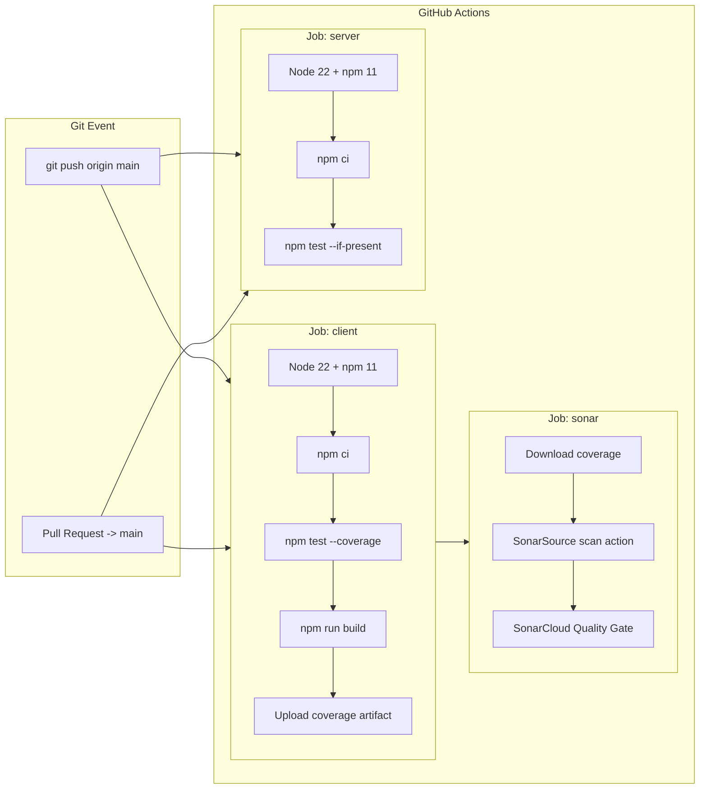

# DONIX - Streamer Donation Platform (AGENTS.md)

เอกสารรวบรวมรายละเอียดสถาปัตยกรรม โครงสร้างโค้ด หน้าระบบทั้งหมด ข้อตกลงในการพัฒนา แนวทางความปลอดภัย และกระบวนการ CI/CD ของโปรเจกต์ **DONIX** ทั้งในส่วนของ **Client (Frontend)** และ **Server (Backend)**

---

## 1. ข้อมูลภาพรวมของระบบ (Project Overview)

**DONIX** คือแพลตฟอร์มรับบริจาคและสนับสนุนสตรีมเมอร์ (Streamer Donation & Overlay Platform) ในรูปแบบ Monorepo ประกอบด้วย 2 แพ็กเกจหลักที่ทำงานแยกกันอย่างอิสระ:

```
Donix/
├── .github/
│   └── workflows/
│       └── ci.yml             → GitHub Actions CI (Automated Test & Build & SonarCloud)
├── client/                    → Frontend React SPA (React 18.3.1 + Tailwind CSS + Lucide React + Recharts)
├── server/                    → Backend REST API & Realtime Server (Express 5 + Socket.IO + MongoDB)
├── sonar-project.properties   → การตั้งค่า SonarCloud Quality Gate & Coverage Exclusions
└── AGENTS.md                  → คู่มือและข้อตกลงในการพัฒนาฉบับสมบูรณ์
```

---

## 2. การติดตั้งและการรันระบบ (Running the Project)

### 2.1 ฝั่ง Server (Backend)
```bash
cd server
npm install
npm run dev      # รันในโหมด Development (Nodemon, Hot-reload บนพอร์ต 5000)
npm start        # รันในโหมด Production
```

### 2.2 ฝั่ง Client (Frontend)
```bash
cd client
npm install
npm start                        # รัน React Dev Server บนพอร์ต 3000 (http://localhost:3000)
npm test -- --watchAll=false     # รัน Jest Test Suite ครั้งเดียวแล้วจบ (ไม่ค้างโหมด watch)
npm run build                    # Build สำหรับ Production (รองรับ CI=true บน GitHub Actions)
```

### 2.3 คำสั่งทดสอบและตรวจสอบ CI สำหรับ Local Environment
```bash
# ทดสอบ Build บน Client ให้เหมือนบน GitHub Actions (CI=true จะเปลี่ยน Warning เป็น Fatal Error)
cd client
set CI=true&& npm test -- --coverage --watchAll=false
set CI=true&& npm run build
```

---

## 3. สภาพแวดล้อมและการตั้งค่า (Environment Variables)

### 3.1 Server (`server/.env`)
| ตัวแปร | รายละเอียด | ค่าเริ่มต้น (Default) |
|---|---|---|
| `PORT` | พอร์ตสำหรับเซิร์ฟเวอร์ Express API | `5000` |
| `MONGODB_URI` | Connection String สำหรับเชื่อมต่อฐานข้อมูล MongoDB | `mongodb://localhost:27017/donix` |
| `CLIENT_URL` | URL ฝั่ง Client สำหรับกำหนดสิทธิ์ CORS | `http://localhost:3000` |
| `JWT_SECRET` | คีย์ลับสำหรับเซ็นและถอดรหัส JWT Token | - |

### 3.2 Client
- Base URL ของ API กำหนดไว้ที่ `http://localhost:5000`
- การจัดการสิทธิ์และการสื่อสารข้ามโดเมนใช้ CORS จากฝั่ง Server
- รองรับการทำงานแบบออฟไลน์/จำลองด้วย `localStorage` ในระหว่างการพัฒนาระบบ

### 3.3 GitHub Actions & SonarCloud Secrets
| Secret Name | แหล่งที่มา | การใช้งาน |
|---|---|---|
| `SONAR_TOKEN` | SonarCloud Account Token | ยืนยันสิทธิ์ในการส่งรายงาน Code Analysis และ Coverage ไปยัง SonarCloud |

---

## 4. โครงสร้างและรายละเอียดระบบฝั่ง Server (`server/`)

### 4.1 สถาปัตยกรรมและเทคโนโลยี
- **ES Modules**: กำหนด `"type": "module"` ใน `package.json` ใช้ `import` / `export`
- **Express 5**: รองรับ Async/Await และ Promise-returning route handlers อย่างสมบูรณ์
- **Socket.IO**: เชื่อมต่อแบบเรียลไทม์ (Attached กับ `req.io`) สำหรับสตรีม Event: `join-stream`, `disconnect`, `donation-alert`
- **Mongoose & MongoDB**: จัดการ Schema ฐานข้อมูลและตรวจสอบ Data Validation
- **Bcryptjs & JWT**: แฮชรหัสผ่านความปลอดภัยสูงและสร้าง Token สำหรับ Authentication

### 4.2 โครงสร้างไฟล์ Server
```
server/
├── config/
│   └── db.js                    → การเชื่อมต่อฐานข้อมูล MongoDB (Mongoose)
├── Models/
│   └── User.js                  → Central User Schema (Authentication, Profile, Payment, Settings)
├── routes/
│   └── auth.js                  → เส้นทาง /api/auth (register, login) พร้อม NoSQL Injection Prevention
├── utils/
│   └── passwordValidation.js    → ฟังก์ชันตรวจสอบความปลอดภัยของรหัสผ่าน (5 เงื่อนไข)
├── index.js                     → Entry Point ของเซิร์ฟเวอร์ Express + Socket.IO
└── package.json
```

### 4.3 รูปแบบการป้องกัน NoSQL Injection (SonarCloud Safe Pattern)
เพื่อป้องกันช่องโหว่ **NoSQL Injection** ตามมาตรฐาน SonarCloud ทุก Route ที่รับค่าจาก `req.body` หรือ `req.query` ต้องใช้รูปแบบ 3 ขั้นตอนนี้เสมอ:
```javascript
// 1. ตรวจสอบ Data Type
if (typeof username !== 'string' || typeof password !== 'string') {
  return res.status(400).json({ message: 'รูปแบบข้อมูลไม่ถูกต้อง' });
}

// 2. ตัด Taint Chain ด้วย String Wrapper และ trim
const safeUsername = String(username).trim().toLowerCase();

// 3. ใช้ Query Operator ($eq) ป้องกัน Object Injection
const user = await User.findOne({ username: { $eq: safeUsername } });
```

### 4.4 รายละเอียด User Schema (`server/Models/User.js`)
- **ข้อมูลการยืนยันตัวตน**: `username` (Unique), `email` (Unique), `password` (Hashed), `googleId`
- **โปรไฟล์**: `profile` (`displayName`, `avatar`, `bio`)
- **โซเชียลมีเดีย**: `socialLinks` (Facebook, Instagram, YouTube, TikTok, Twitch, X)
- **ช่องทางรับเงิน (`payment`)**:
  - `promptpay`: `enabled`, `type` (เบอร์โทรศัพท์/เลขบัตร ปชช.), `number`
  - `bank`: `enabled`, `bankName`, `accountNumber`, `accountName`
  - `truemoney`: `enabled`, `phone`
- **การตั้งค่าหน้ารับเงิน (`donationPage`)**:
  - `welcomeMessage`, `thankYouMessage`, `minAmount`, `charLimit`, `filteredWords`, `coverImage`, `backgroundImage`

---

## 5. โครงสร้างและรายละเอียดระบบฝั่ง Client (`client/`)

### 5.1 สถาปัตยกรรมและเทคโนโลยี
- **React 18**: Single Page Application (SPA) ใช้ React 18.3.1 เข้ากันได้สมบูรณ์กับ Create React App (`react-scripts 5.0.1`)
- **React Router v7**: กำหนดเส้นทาง URL ทั้งหมดใน `src/App.js` พร้อม `<ProtectedRoute>`
- **Tailwind CSS v3**: ตกแต่ง UI ด้วยโทนสีแบรนด์และ Dark Theme:
  - สี: `void` (`#090812`), `abyss` (`#0f0d1b`), `mana` (`#7c3aed`), `gold` (`#fbbf24`), `crimson` (`#ef4444`), `border` (`rgba(255,255,255,0.08)`)
  - ฟอนต์: `Kanit` (Sans-serif ภาษาไทย/สากล) และ `Nanum Myeongjo` (Serif)
- **Lucide React**: ไลบรารีไอคอนมาตรฐานแบบ Named Imports
- **Recharts v2 (`recharts ^2.15.1`)**: แสดงกราฟสถิติยอดโดเนทในหน้า Dashboard

---

### 5.2 เส้นทาง URL และหน้าระบบทั้งหมด (12 หน้าระบบ)

| เส้นทาง (Route) | คอมโพเนนต์หน้า | สิทธิ์เข้าถึง | คำอธิบาย |
|---|---|---|---|
| `/` | `MainPage` | สาธารณะ | หน้าแรก (Landing Page), Hero, ฟีเจอร์, รายชื่อสตรีมเมอร์, Footer |
| `/how-it-works` | `HowToUse` | สาธารณะ | หน้าคู่มือและขั้นตอนการเริ่มต้นใช้งานระบบทีละขั้นตอน |
| `/login` | `Login` | สาธารณะ | หน้าเข้าสู่ระบบ (Email/Password, Google Auth) รับ JWT Token |
| `/register` | `Register` | สาธารณะ | หน้าสมัครสมาชิก พร้อม Password Checklist ตรวจสอบเงื่อนไข 5 ข้อ |
| `/dashboard` | `Dashboard` | สมาชิก (Protected) | หน้าสรุปภาพรวมบัญชี (สถิติยอดเงิน, จำนวนโดเนท, กราฟ, ช่องทางรับเงิน) |
| `/payment` | `PaymentPage` | สมาชิก (Protected) | หน้าตั้งค่าช่องทางรับเงิน (PromptPay, TrueMoney, Bank, Coming Soon) |
| `/donate-page` | `DonatePage` | สมาชิก (Protected) | หน้าตกแต่งหน้ารับเงิน, ข้อความต้อนรับ/ขอบคุณ, ตัวกรองคำหยาบ, โซเชียล |
| `/account` | `Account` | สมาชิก (Protected) | หน้าจัดการโปรไฟล์ ข้อมูลส่วนตัว ความปลอดภัย และเชื่อมต่อโซเชียล |
| `/history` | `HistoryPage` | สมาชิก (Protected) | หน้าตรวจสอบประวัติการรับเงินและตารางรายการโดเนท |
| `/widget` | `WidgetPage` | สมาชิก (Protected) | หน้าตั้งค่าวิดเจ็ต OBS (Alert, Goal, Leaderboard, Mission) + Preview |
| `/:username` หรือ `/donor/:username` | `DonorPage` | สาธารณะ | หน้ารับเงินจริงสำหรับผู้สนับสนุน (Donor) รองรับ 5 สถานะการทำงาน |
| `*` | `NotFound` | สาธารณะ | หน้าแจ้งเตือน 404 ไม่พบหน้าที่ค้นหา พร้อมปุ่มกลับสู่หน้าหลัก |

---

### 5.3 รายละเอียดของแต่ละหน้าระบบหลัก

#### 1) หน้า Landing Page (`/`) และ คู่มือการใช้งาน (`/how-it-works`)
- หน้าแรกนำเสนอจุดเด่นของแพลตฟอร์ม โดดเด่นด้วย Dark Theme และแสงนีออนสีม่วง Mana
- ระบบแนะนำ Streamer ชั้นนำและฟีเจอร์เด่น (Alert เสียง/ภาพ, Goal Bar, Leaderboard, Mission)
- หน้าคู่มือแนะนำการเชื่อมต่อ Browser Source ไปยังโปรแกรม OBS Studio / Streamlabs

#### 2) หน้าระบบสมาชิก (`/login`, `/register`)
- ฟอร์ม Login/Register รองรับ Email, Password และ Social Auth (Google)
- `PasswordChecklist`: ระบบ Interactive Checklist ตรวจสอบความปลอดภัย 5 เงื่อนไขแบบ Real-time:
  1. ความยาวอย่างน้อย 8 ตัวอักษร
  2. ตัวพิมพ์ใหญ่อย่างน้อย 1 ตัว (A-Z)
  3. ตัวพิมพ์เล็กอย่างน้อย 1 ตัว (a-z)
  4. ตัวเลขอย่างน้อย 1 ตัว (0-9)
  5. อักขระพิเศษอย่างน้อย 1 ตัว (!@#$%^&*ฯลฯ)

#### 3) หน้า Dashboard (`/dashboard`)
- **StatCards**: ยอดการรับเงินรวม (บาท), จำนวนโดเนททั้งหมด (ครั้ง), ผู้ชมเฉลี่ย (คน)
- **DonationChart**: กราฟแท่งและเส้นแสดงสถิติยอดโดเนทย้อนหลัง (สัปดาห์/เดือน) ด้วย Recharts
- **RecentDonations & TopDonors & RealtimeFeed**: รายการโดเนทล่าสุด, อันดับผู้สนับสนุนสูงสุด
- **PaymentChannels**: สรุปสถานะการเปิดใช้งานของช่องทาง PromptPay, TrueMoney, และ Bank
- โครงสร้างใช้ **Sticky Sidebar** ทางซ้าย และ **Sticky Topbar** ด้านบน

#### 4) หน้าบัญชีรับเงิน (`/payment`)
- การ์ด 4 ช่องทางการเงิน (2x2 Grid กว้าง `max-w-[1240px]`):
  - **PromptPayCard**: แบนเนอร์สีน้ำเงิน, สวิตช์เปิด/ปิด, เมนูกด `จัดการ ˅`, เลือกเบอร์โทรศัพท์/เลขบัตร ปชช., บันทึกข้อมูล
  - **TrueMoneyCard**: แบนเนอร์สีส้ม, สวิตช์เปิด/ปิด, ฟอร์มเบอร์โทรศัพท์ TrueMoney Wallet
  - **BankCard**: แบนเนอร์สี Slate, สวิตช์เปิด/ปิด, เลือกธนาคาร (SCB, KBank, BBL ฯลฯ), เลขบัญชี, ชื่อบัญชี
  - **ComingSoonCard**: การ์ดแจ้งช่องทางใหม่ในอนาคต (บัตรเครดิต, Crypto)

#### 5) หน้าตกแต่งหน้ารับเงิน (`/donate-page`)
- **DonatePageLink**: แสดงลิงก์หน้ารับเงิน `donix.app/{username}`, ปุ่มคัดลอก, ปุ่มแชร์โซเชียล, และปุ่มเปิดดูตัวอย่างหน้าเว็บในแท็บใหม่
- **DecorateSection**: ข้อความต้อนรับ, ข้อความขอบคุณ, กำหนดยอดโดเนทขั้นต่ำ, อัปโหลดรูปภาพหน้าปกและพื้นหลัง
- **MessageFilterSection**: กำหนดความยาวตัวอักษรสูงสุด, สวิตช์ตัวกรองคำหยาบ, ระบบแท็กคำที่ต้องการบล็อก
- **SocialMediaSection**: เชื่อมต่อลิงก์โซเชียลมีเดีย 6 แพลตฟอร์ม

#### 6) หน้า Donor Page (`/:username`) — หน้ารับโดเนทสำหรับผู้สนับสนุน
ดีไซน์ครอบคลุม **5 สถานะการแสดงผล** ตาม UI Mockup:
1. **Donor-page (offline)**: เมื่อ Widget หรือสตรีมเมอร์ออฟไลน์ Avatar แสดงป้าย `ออฟไลน์` พร้อมการ์ดไอคอน 🚫 "ขณะนี้ปิดรับโดเนทชั่วคราว"
2. **Online - PromptPay**: Avatar มีวงแหวนสีแดงเรืองแสงและป้าย `🔴 LIVE`, ข้อความต้อนรับ, แท็บเลือกช่องทาง, ช่องกรอกชื่อและข้อความ, ช่องกรอกจำนวนเงิน, **PromptPay QR Code อัตโนมัติตามยอดเงิน**, กล่องอัปโหลดสลิป, ปุ่มยืนยันชำระเงิน
3. **Online - Bank**: แสดงข้อมูลบัญชีธนาคารพร้อมปุ่มกดคัดลอกเลขบัญชี, อัปโหลดสลิป, ปุ่มยืนยันชำระเงิน
4. **Online - TrueMoney**: ช่องกรอกลิงก์ซองของขวัญทรูมันนี่ อั่งเปา, ปุ่มยืนยันชำระเงิน
5. **Online - Channel Disabled**: เมื่อสตรีมเมอร์ปิดรับเงินช่องทางนั้น จะแสดงการ์ดไอคอน 🚫 "ไม่พร้อมให้บริการ"
- **Floating Test Controls**: ปุ่มจำลองสลับสถานะ Online/Offline และเปิด/ปิดช่องทางรับเงินเพื่อทดสอบ UI ได้ทันที

#### 7) หน้า Widget Settings (`/widget`)
รองรับการตั้งค่าวิดเจ็ต 4 รูปแบบใน Layout 2 คอลัมน์ (ฟอร์มตั้งค่าซ้าย + Real-time Preview ขวา):
1. **Donate Alert**:
   - *พื้นฐาน*: ยอดขั้นต่ำที่แจ้งเตือน (บาท), อัปโหลดรูปภาพ (JPG/PNG/GIF)
   - *เสียง & TTS*: เสียงแจ้งเตือน (Mythic Horn, Dragon Roar, Ancient Bell, เสียงของฉัน MP3, ไม่มีเสียง), ปรับระดับเสียง, TTS อ่านข้อความโดเนท (ไทย/อังกฤษ, ชาย/หญิง, ปรับความเร็ว 0.5x–2.0x)
   - *ข้อความ*: Template `{user} {amount}`, Shine Effect, ฟอนต์ (Kanit, Cinzel, FC Vision ฯลฯ), ขนาด, สีข้อความ, ขอบตัวอักษร, สีชื่อ/สีจำนวนเงิน
   - *เอฟเฟกต์ & ช่วงเงิน*: แอนิเมชั่นเข้า/ออก, เวลาแสดงผล, ฟิลเตอร์ (Glow, Pulse, Shake, Glitch ฯลฯ), ระบบแสดงผลตามช่วงยอดเงิน (Amount Tiers)
2. **Donate Goal**: ชื่อเป้าหมาย, ธีมสี (Mana, Crimson, Gold), ยอดเริ่มต้น/เป้าหมาย, ช่วงวันที่, หลอด Progress Bar เรืองแสง
3. **Leaderboard**: ชื่อหัวข้อ, เปิด/ปิดแสดงยอดบาท, ช่วงวันที่, ตัวปรับอันดับ 1–10 (ปุ่ม +/-)
4. **Mission Donate**: จัดการช่องภารกิจสูงสุด 12 ช่อง (ชื่อ + ราคา ฿) แสดงผลบนหน้า Donor Page
- **BrowserSourceCard**: แสดงป้ายสถานะ `Live` / `ยังไม่ได้บันทึก`, Browser Source URL สำหรับ OBS, ปุ่มคัดลอก และปุ่ม "ทดสอบ Alert" พร้อมเสียงจำลอง

#### 8) หน้าจัดการบัญชีผู้ใช้ (`/account`)
- `AccountProfileCard`: แสดงรูป Avatar, ชื่อผู้ใช้, อีเมล, สถานะยืนยันตัวตน
- `AccountTabs`: แท็บสลับข้อมูลส่วนตัว (UserInfoTab), ความปลอดภัยเปลี่ยนรหัสผ่าน (SecurityTab), โซเชียลมีเดีย (SocialMediaTab)

#### 9) หน้าประวัติการรับเงิน (`/history`)
- ตารางประวัติรายการโดเนททั้งหมด (`DonationHistoryTable`) พร้อมฟิลเตอร์ค้นหาตามวันที่, ช่องทาง, และสถานะการชำระเงิน

---

## 6. โครงสร้างโฟลเดอร์ Component ฝั่ง Client

```
client/src/
├── assets/                  → โลโก้ รูปภาพประกอบ (PrimaryLogo, HeroLogo, hero, bg-login)
├── components/
│   ├── Account/             → AccountProfileCard, AccountTabs, SecurityTab, SocialMediaTab, UserInfoTab
│   ├── Auth/                → AuthLayout, InputField, PasswordChecklist, SocialAuthButtons, AuthComponents.test.js
│   ├── Dashboard/           → CardWrapper, DonationChart, PaymentChannels, StatsCard, TopDonors, RealtimeFeed, ProtectedRoute.jsx, ProtectedRoute.test.js, DashboardComponents.test.js
│   ├── DonatePage/          → DonatePageLink, DecorateSection, MessageFilterSection, SocialMediaSection, SettingsCard, RichTextField, ImageUploadBox
│   ├── Donor/               → DonorHeader, DonorPaymentTabs, DonorPromptPayForm, DonorBankForm, DonorTrueMoneyForm, DonorSlipUpload, DonorOfflineCard, DonorDisabledCard
│   ├── History/             → DonationHistoryTable
│   ├── MainPage/            → Navbar, Hero, Features, StreamerList, CTASection, Footer, Navbar.test.js
│   ├── Payment/             → PaymentHeader, PromptPayCard, TrueMoneyCard, BankCard, ComingSoonCard
│   ├── Widget/              → WidgetHeader, WidgetTypeTabs, DonateAlertPanel, DonateGoalPanel, LeaderboardPanel, MissionDonatePanel, WidgetPreview, BrowserSourceCard, AccordionSection, AudioUploadField, widgetStorage.js
│   ├── Navigation.test.js   → Unit Test สำหรับ Sidebar และ Topbar
│   ├── Sidebar.jsx          → เมนูหลักซ้ายแบบ Sticky (หมวดทั่วไป และ หมวดการชำระเงิน)
│   └── Topbar.jsx           → แถบเมนูด้านบนแบบ Sticky (Breadcrumb, กระดิ่งแจ้งเตือน, รูปโปรไฟล์)
├── pages/                   → หน้าระบบทั้ง 12 หน้า (MainPage, HowToUse, Login, Register, Dashboard, PaymentPage, DonatePage, Account, HistoryPage, WidgetPage, DonorPage, NotFound)
├── utils/
│   ├── passwordValidation.js→ ตรวจสอบความถูกต้องของรหัสผ่าน
│   └── passwordValidation.test.js → Unit Test กฎรหัสผ่าน 5 ข้อ (100% Coverage)
├── App.js                   → การกำหนดเส้นทาง Routing ทั้งหมด
├── App.test.js              → Test พื้นฐาน (render หน้า Landing Page)
├── setupTests.js            → ตั้งค่า Jest (jest-dom, polyfill TextEncoder/Decoder, ResizeObserver Polyfill)
├── index.css                → สไตล์ CSS หลักและนำเข้า Font Kanit / Tailwind
└── index.js                 → React Root Mounting
```

---

## 7. กฎและข้อตกลงสำคัญในการพัฒนา (Key Conventions)

1. **ภาษาและข้อความ UI**: ข้อความทั้งหมดที่ผู้ใช้เห็น (Labels, Placeholders, Error Messages, Buttons) ให้ใช้ **ภาษาไทย** เสมอ
2. **ไอคอน**: ใช้ named imports จากไลบรารี `lucide-react` เท่านั้น (ยกเว้นโลโก้โซเชียลมีเดีย/แบรนด์ใช้ SVG inline)
3. **การตกแต่งและเลย์เอาต์**:
   - หน้าแดชบอร์ดและหน้าการจัดการทั้งหมดต้องมี **Sidebar** (`sticky top-0 h-screen z-30`) และ **Topbar** (`sticky top-0 z-40 backdrop-blur-xl`)
   - ห้ามใส่ `overflow-x: hidden` บน Container ชั้นนอกที่ครอบ Sidebar/Topbar เพราะจะทำให้ `position: sticky` ของเบราว์เซอร์ไม่ทำงาน
4. **ความปลอดภัยของรหัสผ่าน**: ฟังก์ชัน `utils/passwordValidation.js` มีการใช้งานเหมือนกันทั้งใน `client/` และ `server/` หากมีการปรับเงื่อนไข ต้องอัปเดตทั้ง 2 ฝั่งให้ตรงกัน
5. **การจัดการ State**: หน้า Donor และ Widget รองรับการซิงค์ข้อมูลผ่าน `localStorage` เป็นหลัก และพร้อมสำหรับการต่อยอดเชื่อมต่อ REST API / Cloud Database
6. **ESLint & CI Cleanliness**: ห้ามมี Unused Imports หรือ Unused Variables ในโค้ด เนื่องจาก `CI=true` บน GitHub Actions จะเปลี่ยน Warning เป็น Fatal Error ทันที

---

## 8. แผนการพัฒนาและสถานะโปรเจกต์ (Project Status & Roadmap)

| เฟส (Phase) | รายละเอียด | สถานะ |
|---|---|---|
| **Phase 1: Authentication & User Setup** | Login, Register, Google OAuth, Password Validation, JWT Auth | ✅ เสร็จสมบูรณ์ |
| **Phase 2: Dashboard Overview** | Stats, Recharts Graph, Recent Donations, Layout Sticky Topbar/Sidebar | ✅ เสร็จสมบูรณ์ |
| **Phase 3: Payment Settings** | PromptPay, TrueMoney Wallet, Bank Account Configuration UI | ✅ เสร็จสมบูรณ์ |
| **Phase 4: Donate Page Settings** | Decorate, Message Filter, Social Links, Welcome/Thank You Messages | ✅ เสร็จสมบูรณ์ |
| **Phase 5: Donor Page (5 States)** | Offline, PromptPay QR, Bank, TrueMoney Angpao, Channel Disabled | ✅ เสร็จสมบูรณ์ |
| **Phase 6: Widget Settings UI** | Donate Alert, Goal, Leaderboard, Mission Donate, Live Preview | ✅ เสร็จสมบูรณ์ |
| **Phase 7: OBS Overlay Engine** | หน้า Browser Source แบบโปร่งใสสำหรับ OBS Studio | ⏳ กำลังพัฒนา |
| **Phase 8: Real-time Socket & Alerts** | สตรีม Alert Popup + เสียง + TTS แบบ Real-time ผ่าน Socket.IO | ⏳ กำลังพัฒนา |
| **Phase 9: History & Analytics** | บันทึกประวัติและสรุปยอดโดเนทเชื่อมต่อ MongoDB ถาวร | ⏳ แผนงานถัดไป |
| **Phase 10: Payment Verification** | ระบบตรวจสลิปโอนเงินอัตโนมัติ (Slip Verification API) | ⏳ แผนงานถัดไป |
| **Phase 11: Production Deployment** | Deploy Server (Docker/Cloud) + Client (Vercel/Cloudflare) | ⏳ แผนงานถัดไป |

---

## 9. ระบบ CI/CD, GitHub Actions และ SonarCloud Quality Gate

ไฟล์ Workflow: `.github/workflows/ci.yml`



### 9.1 การตั้งค่า SonarCloud Properties (`sonar-project.properties`)
```properties
sonar.organization=nekomanaja
sonar.projectKey=nekomanaja_Final-Project

# สแกนคุณภาพโค้ดและความปลอดภัยครอบคลุมทั้ง Client และ Server
sonar.sources=client/src,server
sonar.exclusions=**/node_modules/**,**/build/**,**/coverage/**,**/*.test.js,**/setupTests.js,client/public/**

# แยก Scope การวัด Coverage เฉพาะ Client ที่มีรายงาน lcov (ป้องกัน Server และ Bootstrap ฉุด % Coverage ตก)
sonar.coverage.exclusions=server/**,client/src/index.js,client/src/reportWebVitals.js,**/*.test.js,**/setupTests.js
sonar.sourceEncoding=UTF-8
sonar.javascript.lcov.reportPaths=client/coverage/lcov.info
```
> [!NOTE]
> `sonar.coverage.exclusions=server/**` เป็นการยกเว้นเฉพาะข้อกำหนดเปอร์เซ็นต์ Unit Test Coverage ของ Server ชั่วคราว แต่ SonarCloud **ยังคงสแกนช่องโหว่ความปลอดภัย (Security Hotspots, Vulnerabilities, NoSQL Injection, Bugs) ของฝั่ง Server 100% เต็มรูปแบบตามปกติ**

---

### 9.2 รายละเอียดชุดการทดสอบ Unit Tests (7 Test Suites, 36 Tests ผ่าน 100%)
- **`passwordValidation.test.js`**: ทดสอบกฎความปลอดภัยรหัสผ่าน 5 เงื่อนไขและการคืนข้อความ Error
- **`DashboardComponents.test.js`**: ทดสอบ CardWrapper, StatsCard, DonationChart, PaymentChannels, TopDonors, RealtimeFeed และหน้า Dashboard
- **`ProtectedRoute.test.js`**: ทดสอบระบบความปลอดภัยเส้นทาง ป้องกัน Unauthorized เข้าถึงหน้าควบคุม
- **`Navigation.test.js`**: ทดสอบเมนู Sidebar ทั้งหมด, ฟังก์ชัน Logout และ Topbar Breadcrumb
- **`AuthComponents.test.js`**: ทดสอบฟอร์ม InputField, PasswordChecklist, SocialAuthButtons, AuthLayout
- **`Navbar.test.js`**: ทดสอบการแสดงผล Header แถบนำทางทั้งโหมดผู้เยี่ยมชมและโหมดสมาชิก
- **`App.test.js`**: ทดสอบการ Render หน้าแรกของระบบ

---

### 9.3 คู่มือการแก้ปัญหา CI แดง (Troubleshooting & Known Issues)

#### ปัญหาที่ 1: `ReferenceError: ResizeObserver is not defined`
- **สาเหตุ**: Recharts (`ResponsiveContainer`) เรียกใช้ Web API `ResizeObserver` ซึ่งไม่มีอยู่ใน Node/JSDOM Environment
- **วิธีแก้ไข**: เพิ่ม Polyfill Class ใน `client/src/setupTests.js`:
  ```javascript
  class ResizeObserver {
    observe() {}
    unobserve() {}
    disconnect() {}
  }
  window.ResizeObserver = ResizeObserver;
  global.ResizeObserver = ResizeObserver;
  ```

#### ปัญหาที่ 2: `Attempted import error: 'act' is not exported from 'react'`
- **สาเหตุ**: การใช้ React 19 กับ `react-scripts 5.0.1` (Webpack 5) ซึ่ง `react-scripts` รุ่นเดิมยังไม่รองรับ Module Resolution รูปแบบใหม่ของ React 19
- **วิธีแก้ไข**: ตรึงเวอร์ชัน React เป็น `18.3.1` ใน `client/package.json`:
  ```json
  "dependencies": {
    "react": "^18.3.1",
    "react-dom": "^18.3.1",
    "recharts": "^2.15.1"
  },
  "devDependencies": {
    "@testing-library/react": "^16.0.0"
  }
  ```

#### ปัญหาที่ 3: `CI=true npm run build` ล้มเหลวจาก Unused Variables / Imports
- **สาเหตุ**: Create React App ตั้งค่าให้ ESLint Warnings กลายเป็น Fatal Errors เมื่อเปิด `CI=true`
- **วิธีแก้ไข**: ตรวจสอบและลบ import หรือตัวแปรที่ไม่ได้ใช้ออกจากไฟล์คอมโพเนนต์ทั้งหมด

#### ปัญหาที่ 4: `npm test` ค้างไม่ยอมจบกระบวนการ
- **สาเหตุ**: Jest รันในโหมด Interactive Watcher โดยเริ่มต้น
- **วิธีแก้ไข**: ส่ง Flag `--watchAll=false` เสมอในคำสั่งทดสอบ

---

## 10. แผนผังฐานข้อมูลและ Roadmap Models (Database Schema)

### 10.1 User Model (`server/Models/User.js`)
ครอบคลุมข้อมูลบัญชี, โปรไฟล์, การตั้งค่าการรับเงิน, และหน้ารับบริจาค

### 10.2 Donation Model (Roadmap Phase 8-9)
```javascript
{
  streamerId: { type: Schema.Types.ObjectId, ref: 'User', required: true },
  donorName: { type: String, default: 'ผู้ไม่ประสงค์ออกนาม' },
  amount: { type: Number, required: true, min: 1 },
  message: { type: String, default: '' },
  paymentChannel: { type: String, enum: ['promptpay', 'truemoney', 'bank'], required: true },
  status: { type: String, enum: ['pending', 'verified', 'rejected'], default: 'pending' },
  slipUrl: { type: String },
  createdAt: { type: Date, default: Date.now }
}
```

### 10.3 WidgetSettings Model (Roadmap Phase 7-8)
```javascript
{
  userId: { type: Schema.Types.ObjectId, ref: 'User', required: true, unique: true },
  alert: {
    minAmount: Number,
    sound: String,
    volume: Number,
    ttsEnabled: Boolean,
    ttsVoice: String,
    ttsSpeed: Number,
    template: String,
    font: String,
    animation: String,
    duration: Number,
    tiers: Array
  },
  goal: {
    title: String,
    theme: String,
    currentAmount: Number,
    targetAmount: Number,
    endDate: Date
  },
  leaderboard: {
    title: String,
    showAmount: Boolean,
    topCount: Number,
    dateRange: String
  },
  missions: [
    { title: String, price: Number, enabled: Boolean }
  ]
}
```

---

## 11. ขั้นตอนการทำงานร่วมกันบน Git (Branching & Merge Workflow)

1. **สร้าง Feature Branch แยกจาก main**:
   ```bash
   git checkout main
   git pull origin main
   git checkout -b feature/your-feature-name
   ```
2. **ทดสอบ Build และ Test ก่อน Commit**:
   ```bash
   cd client
   npm test -- --watchAll=false
   npm run build
   ```
3. **Commit และ Push ขึ้น GitHub**:
   ```bash
   git add .
   git commit -m "feat: your descriptive commit message"
   git push origin feature/your-feature-name
   ```
4. **เปิด Pull Request (PR) สู่ Branch `main`**:
   - ตรวจสอบให้แน่ใจว่า GitHub Actions CI (client, server, sonar) ผ่านเป็นสีเขียว 100%
   - ผ่าน SonarCloud Quality Gate (0 Bugs, 0 Vulnerabilities, 0 Security Hotspots)
   - ดำเนินการ Merge เข้าสู่ `main`
